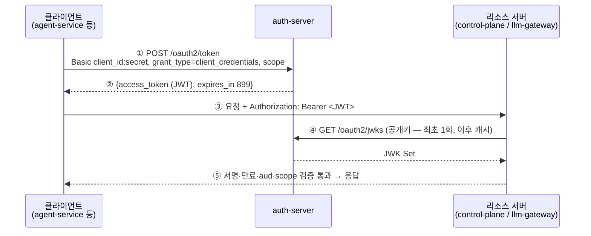

# auth-server

서비스 간(M2M) OAuth 2.1 토큰 발급 — Spring Boot 4.x + Kotlin, Spring Security 7 통합 Authorization Server ([ADR-0016](../docs/adr/0016-mcp-authentication.md)). Client Credentials 전용이며 사람 로그인 표면이 없다.

## 클라이언트와 스코프

| client_id | 스코프 | aud | 용도 |
|-----------|--------|-----|------|
| `agent-service` | `ops:read` `llm:invoke` | control-plane, llm-gateway | MCP 조회 도구 + LLM 호출 — 승인 권한 없음 |
| `control-plane` | `llm:invoke` | llm-gateway | 임베딩 호출 |
| `ops-admin` | `ops:approve` `ops:read` | control-plane | 운영자 curl 승인·조회 |

aud 는 스코프 접두로 도출한다 (`ops:*` → control-plane, `llm:*` → llm-gateway). 토큰 수명 15분, refresh token 없음 — 갱신은 재발급.

## 설정 (env)

| env | 의미 | 필수 |
|-----|------|------|
| `AUTH_ISSUER` | 토큰 `iss` — 리소스 서버 issuer-uri 와 문자 단위 일치 (compose `http://auth-server:8091`, K8s 는 차트 values) | 아니오 — 기본 `http://localhost:8091` (로컬 bootRun) |
| `AUTH_CLIENT_SECRET_AGENT_SERVICE` / `_CONTROL_PLANE` / `_OPS_ADMIN` | 클라이언트 시크릿 — 원천 `infra/.env`(git 미추적), compose 는 pass-through, K8s 는 `create-secrets.sh` → `auth-server-secrets` | **예 — 미설정 = 기동 실패** (기본값을 두지 않아 조용한 무인증 상태가 없다, ADR-0016) |

## 발급 흐름

토큰은 auth-server 가 나눠 주는 것이 아니라 **필요한 클라이언트가 자기 자격증명으로 요청할 때 받아 간다**(pull). 받은 토큰은 리소스 서버에 `Authorization: Bearer` 로 제출하고, 그 뒤로 auth-server 는 개입하지 않는다 — 리소스 서버는 JWKS 의 공개키로 서명을 스스로 검증한다.



| 호출자 | 호출 | 비고 |
|--------|------|------|
| 각 클라이언트 서비스 | `POST /oauth2/token` (HTTP Basic = client_id:secret) | 토큰을 캐시해 재사용, 만료 60초 전 재발급, 401 이면 1회 재발급 후 재시도 — refresh token 없음(Client Credentials) |
| 리소스 서버 | `GET /oauth2/jwks` | issuer-uri 설정이 이 주소를 찾아간다. 클라이언트는 호출할 일이 없다 |
| 운영자 | `POST /oauth2/token` (curl, `ops-admin`) | 승인 API 호출 전에 손으로 발급 |

클라이언트 쪽 구현: agent-service 는 `app/tools/oauth_client.py` 의 `httpx.Auth` 구현체를 MCP 연결에 주입 (2026-08-26 — 캐시·만료 60초 전 재발급·401 시 1회 재시도), control-plane 의 게이트웨이용 RestClient 인터셉터는 llm-gateway 리소스 서버 전환과 함께 구현.

**`scope` 는 반드시 명시한다** — 생략하면 인가 서버는 빈 스코프로 발급하고(`scope`·`aud` 클레임 없음), 리소스 서버가 `aud` 검사에서 401 을 낸다 (2026-08-26 클러스터 실측). 요청 스코프는 등록 스코프의 부분집합이어야 한다.

### 손으로 발급해 보기

```bash
curl -s -u agent-service:$AUTH_CLIENT_SECRET_AGENT_SERVICE \
  -d grant_type=client_credentials -d 'scope=ops:read llm:invoke' \
  http://localhost:8091/oauth2/token
# → {"access_token":"eyJ...","scope":"llm:invoke ops:read","token_type":"Bearer","expires_in":899}
# 권한 밖 스코프(예: agent-service 가 ops:approve) → {"error":"invalid_scope"}, 잘못된 시크릿 → 401
# scope 생략 → 200 이지만 scope·aud 없는 토큰 — 리소스 서버에서 401 (aud 불일치)
# 공개키: GET /oauth2/jwks
```
