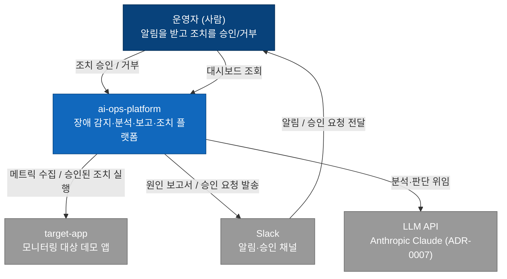
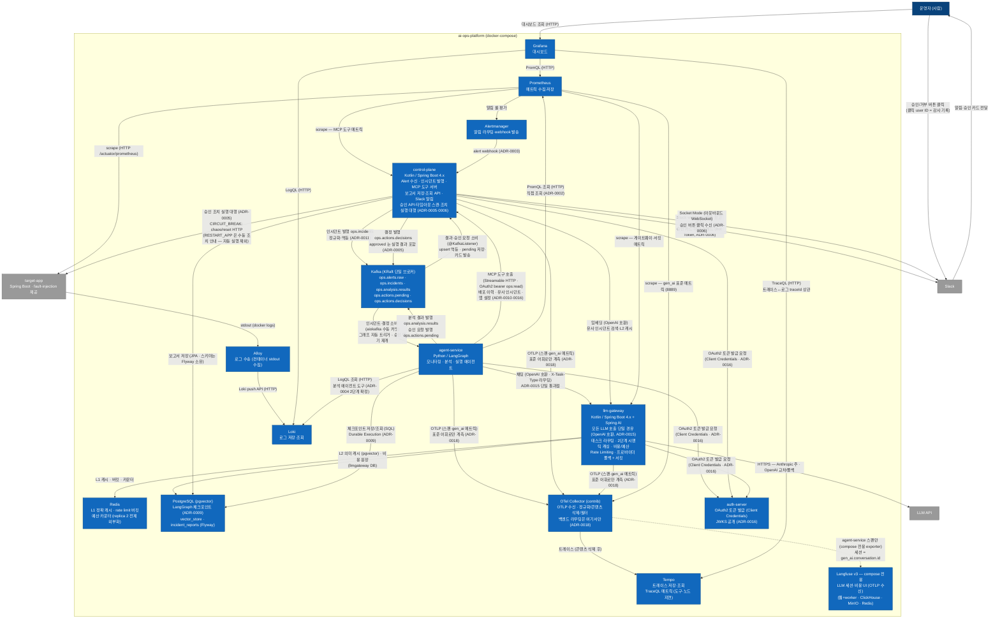
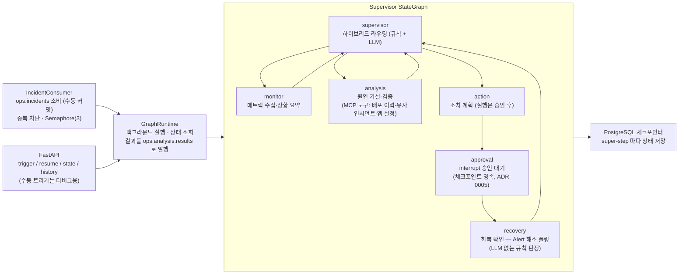
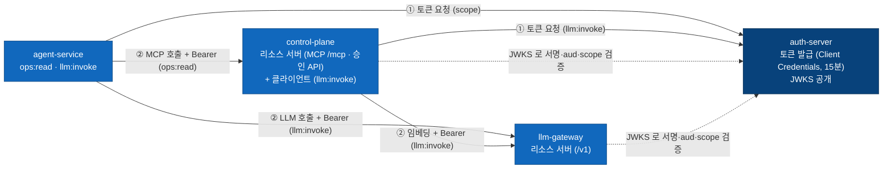

# 시스템 아키텍처 (C4)

C4 모델의 Level 1(System Context)·Level 2(Container). 미결 경로는 **점선**으로 표기하는 관례였으나, 2026-08-04 기준 예약된 미결 경로가 전부 확정 전환되어 현재 점선 없음 — 새 미결 경로가 생기면 같은 관례로 표기하고 [scenarios.md 의 ADR 후보 목록](scenarios.md#미결-사항--adr-후보)에 번호를 예약한다.

갱신 이력: Alertmanager([ADR-0003](adr/0003-alertmanager-webhook.md))·Loki([ADR-0004](adr/0004-loki-adoption.md)) 확정 (2026-07-14) → 2026-07-28 반영: control-plane 실체화, 도구 노출 MCP([ADR-0010](adr/0010-mcp-tool-exposure.md)), 트리거 Kafka 이벤트([ADR-0011](adr/0011-kafka-trigger.md)), 결과 저장·Slack 알림 확정 → 2026-08-04 반영: 승인 왕복 활성(`ops.actions.pending`/`decisions`), Slack 승인 카드·Socket Mode 버튼([ADR-0006](adr/0006-slack-approval-ux.md)), 조치 실행 control-plane 대행([ADR-0005](adr/0005-action-executor.md)), 회복 확인 노드 → 2026-08-22 반영: llm-gateway·Redis 컨테이너 추가([ADR-0015](adr/0015-llm-gateway.md)) — 모든 LLM 호출(채팅·임베딩)이 게이트웨이 단일 경유로 전환, 프로바이더 직접 호출 경로 제거 → 2026-09-02 반영: auth-server 를 Level 2 에 반영(2026-08-25 도입 — 전 M2M 호출 OAuth2 토큰 검증, [ADR-0016](adr/0016-mcp-authentication.md)), Prompt Injection 계층 방어([ADR-0017](adr/0017-prompt-injection-defense.md)) — "보안 아키텍처" 절 신설.

## Level 1 — System Context

플랫폼을 하나의 블랙박스로 보고, 사람·외부 시스템과의 관계만 표현한다. 핵심은 **조치가 플랫폼 단독으로 실행되지 않고 운영자의 승인을 거친다**는 human-in-the-loop 플로우가 이 레벨에서 이미 보인다는 것.

## Level 2 — Container

플랫폼 내부를 실행 단위(컨테이너)로 분해한다. 배포 형상은 둘 — **운영 표준은 K8s (kind + Helm umbrella `charts/aiops`, 진입점 `helm install` 하나, [ADR-0013](adr/0013-k8s-migration.md))**, docker-compose ([ADR-0001](adr/0001-monorepo.md))는 개발용으로 유지한다. K8s Service 명 = compose 컨테이너명이라 아래 컨테이너 관계는 두 형상에서 동일하게 성립한다 (docker 프로파일 무수정 공유).

### agent-service 내부 (Level 3 개요)

Supervisor 오케스트레이션(StateGraph)과 개별 에이전트(create_agent)의 2계층 구조 ([ADR-0008](adr/0008-hybrid-routing.md)). 실행 단위는 인시던트 (thread_id = incident id, [ADR-0009](adr/0009-postgres-checkpointer.md)).

- 트리거는 Kafka 소비가 기본 ([ADR-0011](adr/0011-kafka-trigger.md)) — thread_id = incident_id, done 재트리거 차단(결과는 재발행), 미완 체크포인트는 resume (Durable Execution 결합)
- 에이전트 노드는 async — 노드별 타임아웃(협조적 취소)·재시도·error_handler 로 실패가 상태(`errors`)에 기록되고 부분 보고서로 종료한다 (DAY 13 복원력)
- 개별 에이전트는 create_agent ReAct 루프 — monitor 는 Prometheus 도구, analysis 는 Loki·기준선 로컬 도구 + MCP 도구 3종(배포 이력·유사 인시던트·앱 설정 — [ADR-0010](adr/0010-mcp-tool-exposure.md), 카탈로그는 [tools-catalog.md](tools-catalog.md))을 사용
- action 뒤는 정적 경유지 2단 — approval 은 interrupt 로 사람 결정을 영속 대기 (P3 는 supervisor 조기 종료로 도달하지 않음), recovery 는 실행 성공 시에만 Alert 해소를 재평가 (없으면 skipped 통과 — DAY 24)

### 컨테이너 간 통신 프로토콜

| 구간 | 프로토콜 | 상태 |
|------|----------|------|
| Prometheus → target-app / control-plane | HTTP scrape (`/actuator/prometheus`) | 확정 — control-plane 은 MCP 도구 메트릭 (2026-07-24) |
| agent-service → control-plane (도구) | MCP Streamable HTTP (`/mcp`, OAuth2 Client Credentials bearer — 스코프 `ops:read`) | 확정 ([ADR-0010](adr/0010-mcp-tool-exposure.md)·[ADR-0016](adr/0016-mcp-authentication.md)) — REST 직접 호출 대체, 수동 트리거 REST 는 디버그용 잔존 |
| Prometheus → Alertmanager → control-plane | 알림 룰 + alert webhook (`/webhook/alertmanager`, 공유 시크릿 bearer) | 확정 ([ADR-0003](adr/0003-alertmanager-webhook.md) 완결 2026-07-25, 인증은 ADR-0016) |
| control-plane → Kafka | 프로듀서 — `ops.alerts.raw`(원본 보존)·`ops.incidents`(정규화·멱등, key=incident_id) | 확정 ([ADR-0011](adr/0011-kafka-trigger.md)) |
| Kafka → agent-service | aiokafka 컨슈머 (수동 커밋, 배치 처리 후 commit) → 그래프 자동 트리거 | 확정 ([ADR-0011](adr/0011-kafka-trigger.md)) |
| agent-service → Kafka | 분석 결과 발행 — `ops.analysis.results` (key=incident_id, at-least-once) | 확정 ([ADR-0011](adr/0011-kafka-trigger.md)) |
| Kafka → control-plane | `@KafkaListener` 결과 소비 → upsert 멱등 저장, 신규만 알림 | 확정 (2026-07-27) |
| control-plane → PostgreSQL | JPA (스키마 소유는 Flyway, `ddl-auto: validate`) — `incident_reports` | 확정 (2026-07-27) |
| control-plane → Slack (알림) | incoming webhook (분석 보고 알림, 커밋 후 발송) | 확정 (2026-07-27 실전송) |
| control-plane ↔ Slack (승인) | Slack App — 카드·마감·스레드는 chat.postMessage/update (Bot Token), 버튼 수신은 Socket Mode 아웃바운드 WebSocket (App Token) | 확정 ([ADR-0006](adr/0006-slack-approval-ux.md) — 2026-08-04 실연결·3경로 실측) |
| agent-service → llm-gateway | OpenAI 호환 HTTP (`/v1/chat/completions`) + OAuth2 bearer(`llm:invoke`) — X-Task-Type(라우팅), 비용/한도 차원은 JWT client_id, 응답에 X-Gateway-Cache/Fallback/Downgrade | 확정 ([ADR-0015](adr/0015-llm-gateway.md) — 2026-08-17 전환, 프로바이더 직접 호출 경로 0 · [ADR-0016](adr/0016-mcp-authentication.md) 2026-08-28 토큰 전환) |
| control-plane → llm-gateway | OpenAI 호환 HTTP (`/v1/embeddings`) + OAuth2 bearer(`llm:invoke`, OkHttp 인터셉터) — 유사 인시던트 검색 임베딩 | 확정 ([ADR-0015](adr/0015-llm-gateway.md) · [ADR-0016](adr/0016-mcp-authentication.md)) |
| llm-gateway → LLM API | HTTPS — Anthropic(주)·OpenAI(교차 검증·폴백·임베딩), 프로바이더 장애 시 폴백 체인(교차 재중계 → 로컬 폴백 응답) + 프로바이더 단위 서킷 | 확정 ([ADR-0007](adr/0007-llm-provider.md)·[ADR-0015](adr/0015-llm-gateway.md) — 키 무효화 실측 2026-08-20) |
| llm-gateway → Redis | L1 정확 캐시 · rate limit 버킷(Bucket4j) · 예산 카운터 — 전부 외부 저장 (replica 2 전제) | 확정 (2026-08-18~19) |
| llm-gateway → PostgreSQL | `llmgateway` DB — L2 의미 캐시(pgvector, 유사도 0.95) · 비용 원장(JdbcTemplate) | 확정 (2026-08-18~19) |
| Grafana → Prometheus | PromQL over HTTP | 확정 |
| Grafana → Loki | LogQL over HTTP | 확정 ([ADR-0004](adr/0004-loki-adoption.md)) |
| 에이전트의 관측 데이터 조회 | PromQL over HTTP — 직접 조회 | 확정 ([ADR-0002](adr/0002-observability-access-path.md)) |
| target-app → Alloy → Loki | 컨테이너 stdout 수집 + Loki push API — compose 는 docker discovery, K8s 는 DaemonSet + K8s discovery (service 라벨 = pod `app` 라벨) | 확정 ([ADR-0004](adr/0004-loki-adoption.md) 추가 사항 — Promtail 은 EOL 로 제외, K8s 판은 [ADR-0013](adr/0013-k8s-migration.md)) |
| agent-service → Loki | LogQL 조회 | 확정 — 분석 에이전트 도구 ([ADR-0004](adr/0004-loki-adoption.md) 2단계, 2026-07-18) |
| agent-service → PostgreSQL | SQL (커넥션 풀) | 확정 — LangGraph 체크포인트 ([ADR-0009](adr/0009-postgres-checkpointer.md)) + pgvector 유사 인시던트 검색 |
| agent-service·control-plane·llm-gateway → OTel Collector | OTLP/HTTP (스팬 + agent-service 의 gen_ai 메트릭) — 앱은 Collector 주소만 안다 (`OTEL_EXPORTER_OTLP_ENDPOINT`·`management.opentelemetry.tracing.export.otlp.endpoint`, 미설정 = 전송 없음) | 확정 ([ADR-0018](adr/0018-observability-vendor-neutral.md) — 2026-09-03 exporter 장착, 백엔드 교체 = Collector 설정 변경 실증) |
| OTel Collector → Tempo / Prometheus / Langfuse | Tempo 는 OTLP gRPC (프롬프트 본문 삭제 후) / Prometheus 는 Collector `prometheus` exporter 스크레이프 (`gen_ai.client.token.usage`·`operation.duration`) / Langfuse 는 OTLP/HTTP Basic — **agent-service 스팬만, compose 전용** (세션 = `gen_ai.conversation.id` = 인시던트 id, Langfuse 콜백 제거) | 확정 (ADR-0018 — 2026-09-03 개통, 2026-09-07 콜백 제거) |
| 승인 왕복 (`ops.actions.pending`/`decisions`) | agent-service 가 pending 발행 + interrupt 대기 → control-plane 소비·카드 발송·결정 → decisions 발행 (approved 는 실행 결과 포함) → agent-service 소비·재개 | 확정 ([ADR-0005](adr/0005-action-executor.md) — 2026-08-01 배선, 08-04 실행 결과 포함) |
| 조치 실행 | control-plane 대행 — 자동 실행은 CIRCUIT_BREAK(target-app `chaos/reset` HTTP)뿐, RESTART_APP 은 수동 조치 안내로 전환 (docker socket 마운트 제거) | 확정 ([ADR-0005](adr/0005-action-executor.md) 추가 사항 — 2026-08-04 실측 후 조정) |
| 분산 추적 — Trace Context 전파 | W3C traceparent — HTTP(agent-service → llm-gateway·control-plane → 프로바이더) + **Kafka 헤더**(control-plane Spring Kafka observation ↔ agent-service 수동 스팬) + control-plane `@Async` 경계(전용 풀 + `ContextPropagatingTaskDecorator`) + 로그 traceId 상관 | 확정 (2026-08-22 HTTP, 2026-09-07 Kafka·@Async — 인시던트 1건이 웹훅부터 LLM 까지 하나의 traceId, 승인 전후는 span link, [ADR-0011](adr/0011-kafka-trigger.md) 추가 사항) |
| 분산 추적 — 어휘·시각화 | OTel GenAI 시맨틱 컨벤션 — Client Spans(`chat`)·Agent Spans(`invoke_workflow`/`invoke_agent`/`execute_tool`)·MCP 속성(`mcp.method.name` 등) + Grafana Tempo 데이터소스(로그↔트레이스 양방향) + `genai-observability` 대시보드(표준 메트릭·TraceQL 메트릭) | 확정 ([docs/otel-genai-mapping.md](otel-genai-mapping.md) §3·§4 실측 트리 — 2026-09-07~08) |

> 관측 파이프라인(앱 → OTLP → Collector → Tempo | Prometheus | Langfuse)의 두 형상 차이와 정규화 규칙은 [docs/otel-genai-mapping.md](otel-genai-mapping.md) §2·§5, 결정 배경은 [ADR-0018](adr/0018-observability-vendor-neutral.md).

## 보안 아키텍처

두 축이다 — **인증·인가**(누가 호출했는가, [ADR-0016](adr/0016-mcp-authentication.md))와 **Prompt Injection 계층 방어**(데이터 속 지시를 명령으로 오인하지 않는가, [ADR-0017](adr/0017-prompt-injection-defense.md)). 신뢰 경계·주입 벡터의 전체 도식과 레드팀 결과는 [위협 모델](security/threat-model.md).

### 인증 흐름 (M2M OAuth 2.1 — Client Credentials)

발급자는 `auth-server` 하나, 검증은 각 리소스 서버가 동일 issuer 의 JWKS 로 자체 수행한다 (중앙 게이트웨이 없음 — 순환 결합 회피, ADR-0016). 신뢰 헤더·mTLS 는 JWT 서명이 identity 를 보증하므로 불필요.

- **스코프 분리**: agent-service 는 `ops:read`+`llm:invoke` 만 — 승인(`ops:approve`)은 구조적으로 불가(RT-16 = 403). 조치 실행은 HITL 승인 후 control-plane 대행만 (ADR-0005).
- **직접 경로 차단**: 무인증 승인 API·`X-Client-Service` 헤더 위조(위협 모델 ⑦⑧)는 스코프·JWT client_id 로 해소 (2026-08-26·28).
- **감사**: 모든 M2M 호출이 client_id 와 함께 구조화 로그(`audit`)로 남는다 — 403 은 `authz_denied` 경보.

### Prompt Injection 계층 방어 (ADR-0017)

각 계층을 "주입을 막을 수 있는 가장 신뢰도 높은 지점"에 둔다 — 단일 방어는 없다.

| 계층 | 위치 | 막는 것 | 강제 방식 |
|------|------|---------|----------|
| ① 구조적 분리 | agent-service | 데이터 속 지시를 명령으로 오인 | `<untrusted_content>` 구분자 + 시스템 프롬프트 정책 |
| ② 입력 가드레일 | llm-gateway (강제 지점) | 교과서적 주입·인코딩 우회 | 정규화 + 패턴 1차 + LLM 분류기 2차, 플래깅 우선 |
| ③ 도구 인자 검증 | agent-service | LLM 생성 인자의 오남용 (PromQL/LogQL) | 화이트리스트 결정론 검증 → ValueError |
| ④ 출력/저장 스캔 + 마스킹 | control-plane + llm-gateway | 시크릿·프롬프트 유출·RAG 재주입 오염 | 저장 값 대체 · 발송 마스킹 · 입력 마스킹 |

- **플래깅 우선**: 가드레일 탐지는 기본 차단이 아니라 통과+관측 — 오탐이 장애 대응을 세우는 비용 회피, 후단 계층이 최종 행동 도달을 막는다 (차단 모드는 스위치).
- **강제 지점**: 모든 LLM 호출이 llm-gateway 를 지나므로(ADR-0015) ②·④(입력 마스킹)는 에이전트 코드와 무관하게 강제된다.
- **효과·회귀**: 레드팀 20/20 (baseline 8→0), 계층별 결정론 테스트가 CI 에 고정 (`docs/security/redteam/`).
