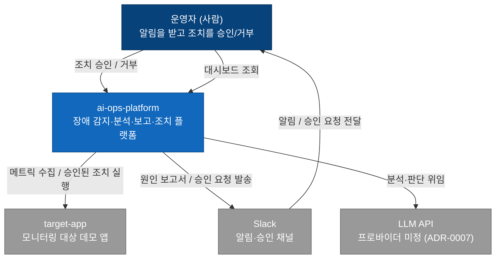
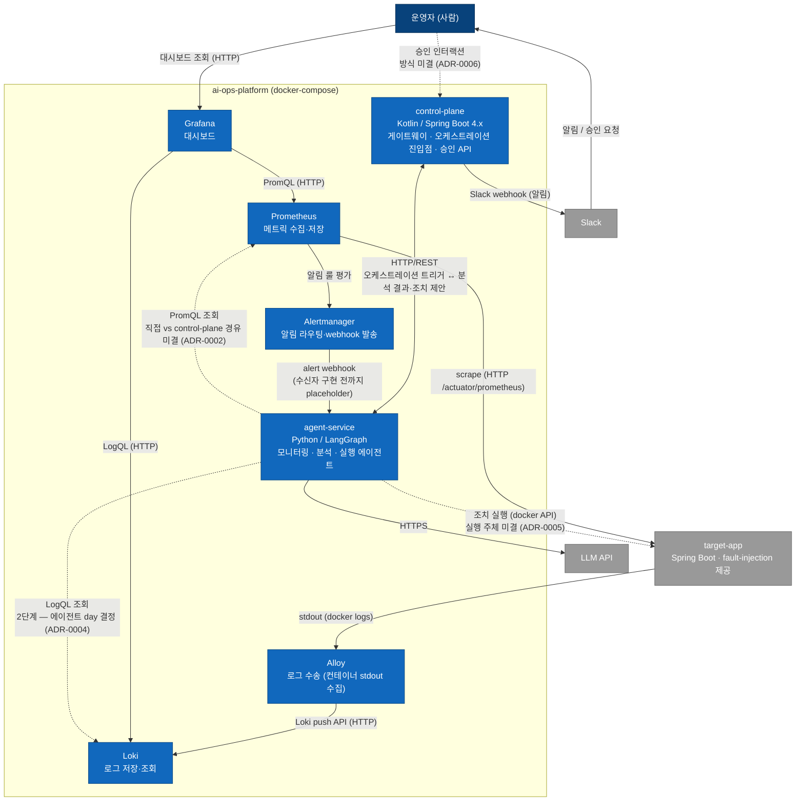

# 시스템 아키텍처 (C4)

C4 모델의 Level 1(System Context)·Level 2(Container) 초안. 미결인 경로는 **점선**으로 표기해 "결정 전"임을 드러낸다 — 각 미결 항목은 [scenarios.md 의 ADR 후보 목록](scenarios.md#미결-사항--adr-후보)에 번호가 예약되어 있다. Alertmanager([ADR-0003](adr/0003-alertmanager-webhook.md))와 Loki([ADR-0004](adr/0004-loki-adoption.md))는 2026-07-14 에 도입 확정되어 실선으로 반영됨.

## Level 1 — System Context

플랫폼을 하나의 블랙박스로 보고, 사람·외부 시스템과의 관계만 표현한다. 핵심은 **조치가 플랫폼 단독으로 실행되지 않고 운영자의 승인을 거친다**는 human-in-the-loop 플로우가 이 레벨에서 이미 보인다는 것.

## Level 2 — Container

플랫폼 내부를 실행 단위(컨테이너)로 분해한다. 통합 지점은 `infra/` 의 docker-compose 하나 ([ADR-0001](adr/0001-monorepo.md)).

### 컨테이너 간 통신 프로토콜

| 구간 | 프로토콜 | 상태 |
|------|----------|------|
| Prometheus → target-app | HTTP scrape (`/actuator/prometheus`) | 확정 |
| control-plane ↔ agent-service | HTTP/REST | 확정 (계약 상세는 API 설계 시) |
| agent-service → LLM API | HTTPS | 확정 (프로바이더는 ADR-0007) |
| control-plane → Slack | incoming webhook (알림) | 확정 — 승인 버튼 인터랙션은 ADR-0006 |
| Grafana → Prometheus | PromQL over HTTP | 확정 |
| Grafana → Loki | LogQL over HTTP | 확정 ([ADR-0004](adr/0004-loki-adoption.md)) |
| 에이전트의 관측 데이터 조회 | PromQL — 직접 vs 게이트웨이 경유 | 미결 (ADR-0002) |
| Prometheus → Alertmanager → agent-service | 알림 룰 + alert webhook | 확정 ([ADR-0003](adr/0003-alertmanager-webhook.md)) — 수신자 구현 전까지 placeholder |
| target-app → Alloy → Loki | 컨테이너 stdout 수집(docker discovery) + Loki push API | 확정 ([ADR-0004](adr/0004-loki-adoption.md) 추기 — Promtail 은 EOL 로 제외) |
| agent-service → Loki | LogQL 조회 | 2단계 — 에이전트 day 결정 (ADR-0004) |
| 조치 실행 | docker API | 미결 (ADR-0005, 실행 주체 포함) |
| 분산 추적 (OTLP → Tempo) | OTLP | 로드맵 9월 — 도입 시 Level 2 갱신 |

> OTLP/Tempo 는 현재 컨테이너 목록에 없다. [README 로드맵](../README.md#로드맵)의 9월(Observability) 단계에서 도입하며, 그 시점에 이 다이어그램을 갱신한다.
