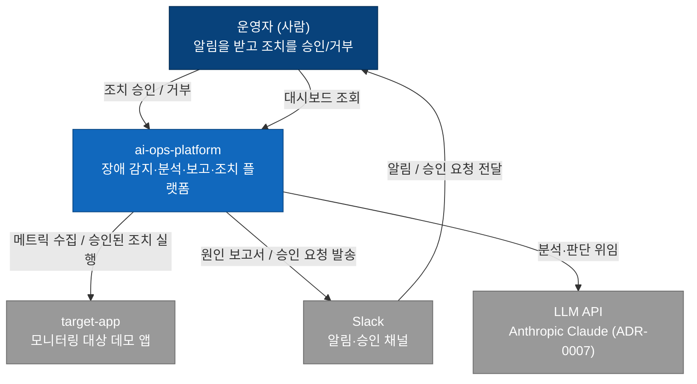
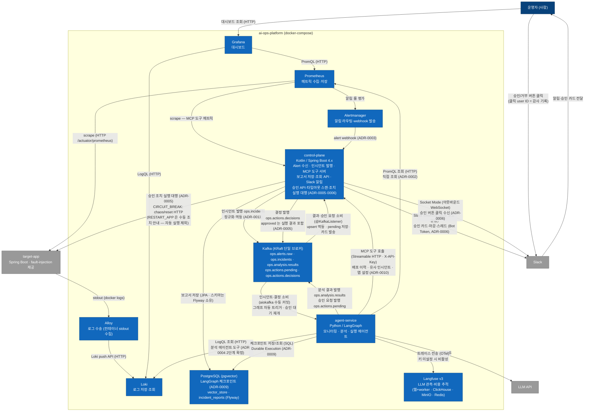
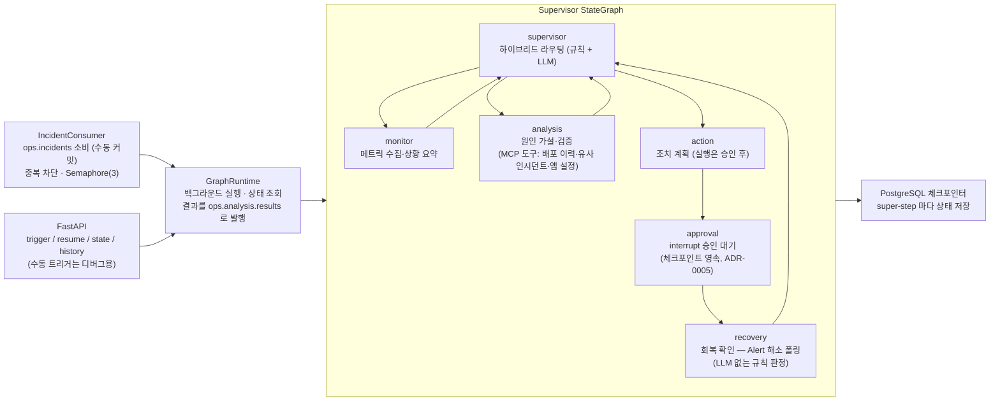

# 시스템 아키텍처 (C4)

C4 모델의 Level 1(System Context)·Level 2(Container). 미결 경로는 **점선**으로 표기하는 관례였으나, 2026-08-04 기준 예약된 미결 경로가 전부 확정 전환되어 현재 점선 없음 — 새 미결 경로가 생기면 같은 관례로 표기하고 [scenarios.md 의 ADR 후보 목록](scenarios.md#미결-사항--adr-후보)에 번호를 예약한다.

갱신 이력: Alertmanager([ADR-0003](adr/0003-alertmanager-webhook.md))·Loki([ADR-0004](adr/0004-loki-adoption.md)) 확정 (2026-07-14) → 3주차 마감 반영 (2026-07-28): control-plane 실체화, 도구 노출 MCP([ADR-0010](adr/0010-mcp-tool-exposure.md)), 트리거 Kafka 이벤트([ADR-0011](adr/0011-kafka-trigger.md)), 결과 저장·Slack 알림 확정 → 4주차 반영 (2026-08-04): 승인 왕복 활성(`ops.actions.pending`/`decisions`), Slack 승인 카드·Socket Mode 버튼([ADR-0006](adr/0006-slack-approval-ux.md)), 조치 실행 control-plane 대행([ADR-0005](adr/0005-action-executor.md)), 회복 확인 노드.

## Level 1 — System Context

플랫폼을 하나의 블랙박스로 보고, 사람·외부 시스템과의 관계만 표현한다. 핵심은 **조치가 플랫폼 단독으로 실행되지 않고 운영자의 승인을 거친다**는 human-in-the-loop 플로우가 이 레벨에서 이미 보인다는 것.

## Level 2 — Container

플랫폼 내부를 실행 단위(컨테이너)로 분해한다. 배포 형상은 둘 — **운영 표준은 K8s (kind + Helm umbrella `charts/aiops`, 진입점 `helm install` 하나, [ADR-0013](adr/0013-k8s-migration.md))**, docker-compose ([ADR-0001](adr/0001-monorepo.md))는 개발용으로 유지한다. K8s Service 명 = compose 컨테이너명이라 아래 컨테이너 관계는 두 형상에서 동일하게 성립한다 (docker 프로파일 무수정 공유).

### agent-service 내부 (Level 3 개요)

Supervisor 오케스트레이션(StateGraph)과 개별 에이전트(create_agent)의 2계층 구조 ([ADR-0008](adr/0008-hybrid-routing.md)). 실행 단위는 인시던트 (thread_id = incident id, [ADR-0009](adr/0009-postgres-checkpointer.md)).

- 트리거는 Kafka 소비가 기본 ([ADR-0011](adr/0011-kafka-trigger.md)) — thread_id = incident_id, done 재트리거 차단(결과는 재발행), 미완 체크포인트는 resume (Durable Execution 결합)
- 에이전트 노드는 async — 노드별 타임아웃(협조적 취소)·재시도·error_handler 로 실패가 상태(`errors`)에 기록되고 부분 보고서로 종료한다 (DAY 13 복원력)
- 개별 에이전트는 create_agent ReAct 루프 — monitor 는 Prometheus 도구, analysis 는 Loki·기준선 로컬 도구 + MCP 도구 3종(배포 이력·유사 인시던트·앱 설정 — [ADR-0010](adr/0010-mcp-tool-exposure.md), 카탈로그는 [tools-catalog.md](tools-catalog.md))을 사용
- action 뒤는 정적 경유지 2단 — approval 은 interrupt 로 사람 결정을 영속 대기 (P3 는 supervisor 조기 종료로 도달하지 않음), recovery 는 실행 성공 시에만 Alert 해소를 재평가 (없으면 skipped 통과 — DAY 24)

### 컨테이너 간 통신 프로토콜

| 구간 | 프로토콜 | 상태 |
|------|----------|------|
| Prometheus → target-app / control-plane | HTTP scrape (`/actuator/prometheus`) | 확정 — control-plane 은 MCP 도구 메트릭 (2026-07-24) |
| agent-service → control-plane (도구) | MCP Streamable HTTP (`/mcp`, X-API-Key) | 확정 ([ADR-0010](adr/0010-mcp-tool-exposure.md)) — REST 직접 호출 대체, 수동 트리거 REST 는 디버그용 잔존 |
| Prometheus → Alertmanager → control-plane | 알림 룰 + alert webhook (`/webhook/alertmanager`) | 확정 ([ADR-0003](adr/0003-alertmanager-webhook.md) 완결 2026-07-25) |
| control-plane → Kafka | 프로듀서 — `ops.alerts.raw`(원본 보존)·`ops.incidents`(정규화·멱등, key=incident_id) | 확정 ([ADR-0011](adr/0011-kafka-trigger.md)) |
| Kafka → agent-service | aiokafka 컨슈머 (수동 커밋, 배치 처리 후 commit) → 그래프 자동 트리거 | 확정 ([ADR-0011](adr/0011-kafka-trigger.md)) |
| agent-service → Kafka | 분석 결과 발행 — `ops.analysis.results` (key=incident_id, at-least-once) | 확정 ([ADR-0011](adr/0011-kafka-trigger.md)) |
| Kafka → control-plane | `@KafkaListener` 결과 소비 → upsert 멱등 저장, 신규만 알림 | 확정 (2026-07-27) |
| control-plane → PostgreSQL | JPA (스키마 소유는 Flyway, `ddl-auto: validate`) — `incident_reports` | 확정 (2026-07-27) |
| control-plane → Slack (알림) | incoming webhook (분석 보고 알림, 커밋 후 발송) | 확정 (2026-07-27 실전송) |
| control-plane ↔ Slack (승인) | Slack App — 카드·마감·스레드는 chat.postMessage/update (Bot Token), 버튼 수신은 Socket Mode 아웃바운드 WebSocket (App Token) | 확정 ([ADR-0006](adr/0006-slack-approval-ux.md) — 2026-08-04 실연결·3경로 실측) |
| agent-service → LLM API | HTTPS | 확정 — Anthropic Claude Sonnet 5 ([ADR-0007](adr/0007-llm-provider.md)) |
| Grafana → Prometheus | PromQL over HTTP | 확정 |
| Grafana → Loki | LogQL over HTTP | 확정 ([ADR-0004](adr/0004-loki-adoption.md)) |
| 에이전트의 관측 데이터 조회 | PromQL over HTTP — 직접 조회 | 확정 ([ADR-0002](adr/0002-observability-access-path.md)) |
| target-app → Alloy → Loki | 컨테이너 stdout 수집 + Loki push API — compose 는 docker discovery, K8s 는 DaemonSet + K8s discovery (service 라벨 = pod `app` 라벨) | 확정 ([ADR-0004](adr/0004-loki-adoption.md) 추가 사항 — Promtail 은 EOL 로 제외, K8s 판은 [ADR-0013](adr/0013-k8s-migration.md)) |
| agent-service → Loki | LogQL 조회 | 확정 — 분석 에이전트 도구 ([ADR-0004](adr/0004-loki-adoption.md) 2단계, 2026-07-18) |
| agent-service → PostgreSQL | SQL (커넥션 풀) | 확정 — LangGraph 체크포인트 ([ADR-0009](adr/0009-postgres-checkpointer.md)) + pgvector 유사 인시던트 검색 |
| agent-service → Langfuse | OTel (HTTP) | 확정 — 자체 compose 스택 (v3, thread_id = 세션), 키 미설정 시 비활성. K8s 형상에는 미배포 (주간 한정 비활성 — 9월 Observability 재검토) |
| 승인 왕복 (`ops.actions.pending`/`decisions`) | agent-service 가 pending 발행 + interrupt 대기 → control-plane 소비·카드 발송·결정 → decisions 발행 (approved 는 실행 결과 포함) → agent-service 소비·재개 | 확정 ([ADR-0005](adr/0005-action-executor.md) — 2026-08-01 배선, 08-04 실행 결과 포함) |
| 조치 실행 | control-plane 대행 — 자동 실행은 CIRCUIT_BREAK(target-app `chaos/reset` HTTP)뿐, RESTART_APP 은 수동 조치 안내로 전환 (docker socket 마운트 제거) | 확정 ([ADR-0005](adr/0005-action-executor.md) 추가 사항 — 2026-08-04 실측 후 조정) |
| 분산 추적 (OTLP → Tempo) | OTLP | 로드맵 9월 — 도입 시 Level 2 갱신 |

> OTLP/Tempo 는 현재 컨테이너 목록에 없다. [README 로드맵](../README.md#로드맵)의 9월(Observability) 단계에서 도입하며, 그 시점에 이 다이어그램을 갱신한다.
