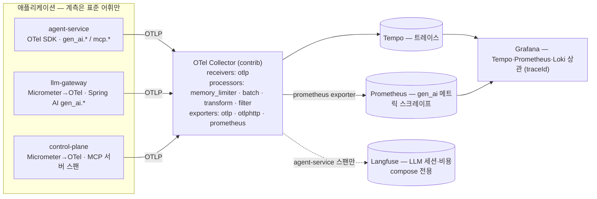

# OTel GenAI 계측 매핑 — 구성요소 ↔ 시맨틱 컨벤션

> 대상: agent-service · llm-gateway · control-plane 의 LLM/에이전트/MCP 계측. 근거 규격은 OpenTelemetry GenAI 시맨틱 컨벤션(전용 리포 [`open-telemetry/semantic-conventions-genai`](https://github.com/open-telemetry/semantic-conventions-genai) — 2026-05-05 분리, 2026-09-03 기준 공식 릴리즈·태그 없음, 전 문서 상태 **Development**). 컨벤션이 이동 중이므로 아래 pin 표의 버전을 기준으로 속성을 고정하고, 버전을 올릴 때 이 문서의 속성 목록을 diff 한다. 결정 배경은 [ADR-0018](adr/0018-observability-vendor-neutral.md).

## 1. 버전 고정 (pin)

| 구성 | 버전 | 비고 |
|---|---|---|
| opentelemetry-sdk / api / exporter-otlp-proto-http (Python) | 1.44.0 | exporter 는 명시 의존 |
| opentelemetry-semantic-conventions / instrumentation-httpx | 0.65b0 | `gen_ai_attributes` 60종 + `mcp_attributes` 4종 수록 |
| opentelemetry-instrumentation-openai-v2 | 2.4b0 | Client Spans·Metrics 발신 (openai SDK 훅 — 게이트웨이 호출 경로) |
| opentelemetry-util-genai | 1.1b0 | Agent·Tool·Workflow 스팬 핸들러 — 실험 컨벤션 전용 |
| opentelemetry-instrumentation-aiokafka | 0.65b0 | Kafka 소비 측 컨텍스트 추출 |
| 옵트인 환경변수 | `OTEL_SEMCONV_STABILITY_OPT_IN=gen_ai_latest_experimental` | openai-v2 문서 명시 |
| Spring AI (llm-gateway·control-plane) | 2.0.0 | ChatModel 관측이 `gen_ai.system` 세대 속성 발신 — §5 정규화 |
| micrometer-tracing-bridge-otel / opentelemetry (JVM) | 1.7.0 / 1.62.0 | Spring Boot 4.1.0 관리, `opentelemetry-exporter-otlp` 추가 |
| Langfuse server / worker | 3.222.0 | OTLP traces 수신 `/api/public/otel/v1/traces` (Basic public:secret), logs 엔드포인트 없음 |

## 2. 파이프라인

앱은 표준 어휘로 계측하고 Collector 하나만 바라본다. 백엔드 교체·추가는 Collector exporter 설정으로 끝나며 앱 재배포가 없다.



| 항목 | compose | K8s (Helm umbrella) |
|---|---|---|
| Collector | `otel-collector` 서비스 (`infra/otel/collector.yml`) | `opentelemetry-collector` 차트 의존, Deployment |
| Tempo | `tempo` 서비스 (monolithic, 로컬 스토리지) | `tempo` 차트 의존 |
| Langfuse exporter | 활성 (compose 스택 내 Langfuse) | 없음 — Langfuse 미배포 |
| 메트릭 | Collector `prometheus` exporter → Prometheus 스크레이프 잡 | 동일 + ServiceMonitor |
| 콘텐츠 | 스팬 속성 캡처 후 Tempo 경로에서 삭제 (§6) | 캡처 안 함 |

두 형상의 차이는 Langfuse exporter 유무 하나다. 이 차이가 "백엔드 교체 = Collector 설정 변경"의 실증이다.

## 3. 구성요소 ↔ 컨벤션 계층

| 계층 | 우리 구성요소 | 스팬/메트릭 이름 | 필수·권장 속성 (규격) | 발신 지점 |
|---|---|---|---|---|
| Client Spans (`gen-ai-spans.md`) | agent-service → llm-gateway 채팅 호출 | `chat {gen_ai.request.model}` = `chat default`, CLIENT | 필수 `gen_ai.operation.name`·`gen_ai.provider.name` / 조건부 `gen_ai.request.model`·`gen_ai.conversation.id`·`server.port`·`error.type` / 권장 `gen_ai.response.model`·`gen_ai.usage.input_tokens`·`gen_ai.usage.output_tokens`·`gen_ai.response.finish_reasons`·`gen_ai.response.id`·`server.address` | openai-v2 계측 (자동) |
| Client Spans — 서버 측 | llm-gateway → Anthropic/OpenAI | `chat claude-sonnet-5` 등, CLIENT | Spring AI 발신: `gen_ai.system`·`gen_ai.operation.name`·`gen_ai.request.model`·`gen_ai.response.model`·`gen_ai.usage.*`·`gen_ai.response.{id,finish_reasons}` | Spring AI ChatModel 관측 (자동) |
| Agent Spans (`gen-ai-agent-spans.md`) | LangGraph 실행 1건 | `invoke_workflow incident-response`, INTERNAL | 필수 `gen_ai.operation.name=invoke_workflow` / 조건부 `gen_ai.workflow.name`·`gen_ai.conversation.id` | util-genai `workflow()` — 현행 `incident.run`·`incident.resume` 대체 |
| Agent Spans | Supervisor 라우팅·monitor·analysis·action 노드 | `invoke_agent {gen_ai.agent.name}`, INTERNAL | 필수 `gen_ai.operation.name=invoke_agent` / 조건부 `gen_ai.agent.name`·`gen_ai.conversation.id` / 권장 `gen_ai.request.model`·`gen_ai.usage.*` | util-genai `invoke_local_agent()` (노드 래핑) |
| Agent Spans — 도구 | 로컬 도구 5종(`query_prometheus`·`query_prometheus_range`·`compare_with_baseline`·`get_active_alerts`·`get_app_logs`) + MCP 도구 3종 | `execute_tool {gen_ai.tool.name}`, INTERNAL | 필수 `gen_ai.operation.name=execute_tool` / 조건부 `gen_ai.tool.name`·`gen_ai.tool.call.id`·`error.type` / 권장 `gen_ai.tool.type`·`gen_ai.tool.description` / 옵트인 `gen_ai.tool.call.arguments`·`gen_ai.tool.call.result` | util-genai `tool()` (도구 래퍼) |
| MCP (`mcp.md`) — 클라이언트 | agent-service → control-plane `tools/call` | 별도 스팬 없음 — 위 `execute_tool` 스팬에 MCP 속성 추가 (규격: 외부 GenAI 계측이 도구 실행을 추적 중이면 별도 스팬을 만들지 않는다) | `mcp.method.name=tools/call`·`gen_ai.tool.name` / 권장 `mcp.session.id`·`mcp.protocol.version`·`server.address`·`server.port`·`network.protocol.name=http` | MCP 도구 래퍼 (`mcp_tools.py`) |
| MCP — 서버 | control-plane MCP 서버 | `tools/call {gen_ai.tool.name}`, SERVER (Spring MVC `POST /mcp` 서버 스팬의 자식) | 필수 `mcp.method.name` / 조건부 `gen_ai.tool.name`·`jsonrpc.request.id`·`rpc.response.status_code`·`error.type` / 권장 `mcp.session.id`·`mcp.protocol.version`·`client.address` | `McpToolMetrics` 래핑 지점 (Spring AI 2.0.0 MCP 모듈은 관측 미제공) |
| Events (`gen-ai-events.md`) | 프롬프트·응답 본문 | `gen_ai.client.inference.operation.details` (로그 시그널) 또는 스팬 속성 `gen_ai.input.messages`·`gen_ai.output.messages`·`gen_ai.system_instructions` — 전부 **옵트인** | 구조화 형식 `{role, parts:[{type, content}]}` | openai-v2 계측, 캡처 모드 환경변수 (§6) |
| Metrics (`gen-ai-metrics.md`) | LLM 호출 토큰·지연 | `gen_ai.client.token.usage` ({token}, histogram, `gen_ai.token.type=input\|output`) · `gen_ai.client.operation.duration` (s) | 필수 `gen_ai.operation.name`·`gen_ai.provider.name`(·`gen_ai.token.type`) / 조건부 `gen_ai.request.model`·`server.port` / 권장 `server.address` | openai-v2 계측 → OTel Metrics SDK → OTLP |
| Metrics — MCP | MCP 호출 지연 | `mcp.client.operation.duration`·`mcp.server.operation.duration` (s, histogram) | `mcp.method.name`·`gen_ai.tool.name` | 클라이언트 = 스팬 기반 산출 또는 Collector spanmetrics, 서버 = 기존 `mcp.tool.calls` 유지(우리 확장) |
| Provider (`openai.md`·`anthropic.md`) | 프로바이더별 확장 | `gen_ai.openai.*`·`gen_ai.usage.cache_*` 등 | Spring AI 가 발신하는 범위만 | 자동 |

`gen_ai.conversation.id` 는 **인시던트 id** 다. 규격은 "라이브러리나 앱이 대화 식별자를 명시적으로 제공할 때만" 채우고 UUID·traceId 를 대체값으로 쓰지 말라고 하므로, LangGraph `thread_id`(= incident id)를 앱이 명시적으로 부여한다. Langfuse 는 이 속성을 세션으로 인식한다(2026-09-03 실측 — `session.id`·`langfuse.session.id` 도 인식하나 표준 이름만 쓴다).

## 4. 인시던트 1건의 목표 스팬 트리

```
invoke_workflow incident-response            agent-service · INTERNAL · gen_ai.conversation.id=inc-… · incident.id=inc-…
├─ (부모) POST ops.incidents 소비             Kafka 헤더 traceparent — control-plane 웹훅 → Kafka 발행 스팬이 부모
├─ invoke_agent supervisor                    라우팅 결정 (routing-decision)
│  └─ chat default                            CLIENT → llm-gateway
│     └─ POST /v1/chat/completions            llm-gateway · SERVER (Spring MVC)
│        └─ chat claude-haiku-4-5             llm-gateway · Spring AI CLIENT → Anthropic
├─ invoke_agent monitor
│  ├─ chat default → … (위와 동일 구조)
│  ├─ execute_tool query_prometheus           로컬 도구 → GET /api/v1/query (httpx CLIENT)
│  └─ execute_tool getDeploymentHistory       MCP 속성 동반 (mcp.method.name=tools/call)
│     └─ POST /mcp                            control-plane · SERVER
│        └─ tools/call getDeploymentHistory   control-plane · SERVER (MCP)
├─ invoke_agent analysis                      (도구·채팅 동일 구조)
├─ invoke_agent action
├─ approval                                   승인 대기 interrupt — 여기서 trace 종료
└─ recovery                                   규칙 폴링 (LLM 없음)

invoke_workflow incident-response (resume)   새 trace · link → 위 trace (승인 전후 연결)
```

`approval`·`recovery` 는 LLM 이 없는 노드라 GenAI 계층 밖이다. 우리 확장 속성 `aiops.node` 로 구분한다.

## 5. 우리 확장 속성과 정규화 규칙

표준이 다루지 않는 것은 자체 네임스페이스에 둔다. 표준 네임스페이스(`gen_ai.*`·`mcp.*`)에 임의 키를 추가하지 않는다.

| 네임스페이스 | 속성/메트릭 | 출처 |
|---|---|---|
| `incident.id` | 인시던트 id (스팬 속성 — `gen_ai.conversation.id` 와 같은 값, Tempo 검색 축) | agent-service |
| `aiops.node` | LangGraph 노드 이름 (supervisor·monitor·analysis·action·approval·recovery) | agent-service |
| `gateway.task_type`·`gateway.cache`·`gateway.guardrail`·`gateway.guardrail_stage`·`gateway.downgrade`·`gateway.fallback` | 게이트웨이 판정 (요청 헤더 `X-Task-Type`, 응답 헤더 `X-Gateway-*`) — 클라이언트 스팬 속성 | agent-service (응답 훅) · llm-gateway (서버 스팬) |
| `gateway.*` 메트릭 11종 · `mcp.tool.calls` | 기존 Micrometer 유지 (캐시·비용·예산·가드레일·마스킹 — 표준에 대응물 없음) | llm-gateway · control-plane |
| `client_id`·`scope` | 감사 로그 MDC 필드를 서버 스팬 속성으로도 부여 (Loki 축과 Tempo 축 공용) | llm-gateway · control-plane |

Collector `transform` 규칙:

| 규칙 | 대상 | 이유 |
|---|---|---|
| `gen_ai.system` → `gen_ai.provider.name` 복제 | llm-gateway 스팬 (Spring AI 2.0.0) | 세대 차이 정규화 — 원본 키는 유지 |
| `gen_ai.input.messages`·`gen_ai.output.messages`·`gen_ai.system_instructions` 삭제 | Tempo exporter 경로 | 콘텐츠는 Langfuse 경로만 (§6) |
| `service.name == agent-service` 만 통과 (`filter`) | Langfuse exporter 경로 | 같은 LLM 호출이 agent-service(클라이언트)·llm-gateway(Spring AI) 두 스팬으로 나오므로 비용 이중 집계 방지 |

`gen_ai.provider.name` 은 계측기가 "아는 범위"로 채운다는 규격(프록시·호스팅 플랫폼 경유 시 실제 상류와 다를 수 있음)에 따라, agent-service 클라이언트 스팬은 `openai`(OpenAI 호환 엔드포인트) 로 두고 보정하지 않는다. 실프로바이더는 llm-gateway 스팬(`anthropic`/`openai`)과 `gateway.requests{provider}` 메트릭이 담당한다. 모델 식별은 두 스팬 모두 `gen_ai.response.model`(게이트웨이가 폴백·다운그레이드를 반영한 실모델을 응답 `model` 필드로 반환)로 한다.

## 6. 콘텐츠 캡처 정책

프롬프트 본문은 규격상 옵트인이며 PII 를 포함할 수 있다. 우리 시스템에서는 캡처 지점(agent-service)이 llm-gateway 입력 마스킹보다 **앞**이라, 캡처된 본문은 마스킹 전 원문이다.

| 프로파일 | `OTEL_INSTRUMENTATION_GENAI_CAPTURE_MESSAGE_CONTENT` | 결과 |
|---|---|---|
| 로컬 (compose) | `SPAN_ONLY` | 스팬 속성 `gen_ai.input/output.messages` 로 캡처 → Langfuse 입출력 표시(2026-09-03 실측), Tempo 경로는 Collector 가 삭제 |
| 운영 (K8s) | 미설정 (`NO_CONTENT`) | 캡처 없음 — 원문이 관측 백엔드로 나가지 않는다 |

`EVENT_ONLY`(로그 이벤트 `gen_ai.client.inference.operation.details`)가 규격이 권장하는 형태이나, Tempo 와 Langfuse 모두 OTLP 로그를 소비하지 않아(Langfuse logs 엔드포인트 없음 — 실측 404) 채택하지 않는다. Loki 로 보내는 대안은 필요가 생길 때 판단한다. Spring AI 의 `spring.ai.chat.observations.log-prompt/log-completion` 은 로그 출력 방식이며 기본 false 를 유지한다.

## 7. 갱신 절차

1. pin 표의 버전을 바꾸기 전에 `agent-service/tests/test_otel.py` 의 속성 계약 테스트가 GREEN 인지 확인한다.
2. 버전을 올린 뒤 스크래치 실측(목 게이트웨이 + InMemory exporter)으로 발신 속성 목록을 뽑아 §3 표와 diff 한다.
3. 이름이 바뀐 속성은 Collector `transform` 에 구키→신키 복제 규칙을 두고, 대시보드 쿼리를 신키로 옮긴 뒤 규칙을 제거한다 (이중 발신 기간 운영).
4. 변경 내용을 이 문서와 ADR-0018 추가 사항에 날짜와 함께 기록한다.
