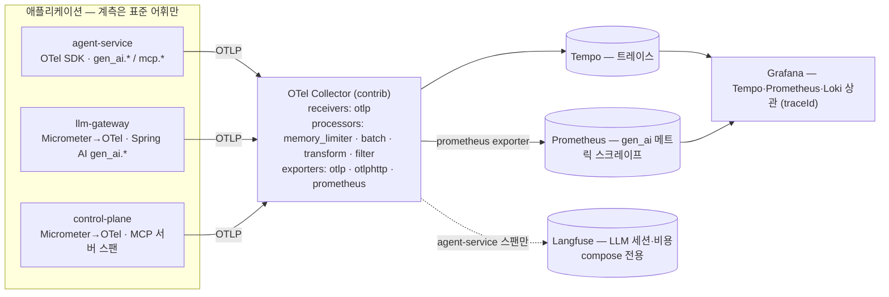

# OTel GenAI 계측 매핑 — 구성요소 ↔ 시맨틱 컨벤션

> 대상: agent-service · llm-gateway · control-plane 의 LLM/에이전트/MCP 계측. 근거 규격은 OpenTelemetry GenAI 시맨틱 컨벤션(전용 리포 [`open-telemetry/semantic-conventions-genai`](https://github.com/open-telemetry/semantic-conventions-genai) — 2026-05-05 분리, 2026-09-03 기준 공식 릴리즈·태그 없음, 전 문서 상태 **Development**). 컨벤션이 이동 중이므로 아래 pin 표의 버전을 기준으로 속성을 고정하고, 버전을 올릴 때 이 문서의 속성 목록을 diff 한다. 결정 배경은 [ADR-0018](adr/0018-observability-vendor-neutral.md).

## 1. 버전 고정 (pin)

| 구성 | 버전 | 비고 |
|---|---|---|
| opentelemetry-sdk / api / exporter-otlp-proto-http (Python) | 1.44.0 | exporter 는 명시 의존 |
| opentelemetry-semantic-conventions / instrumentation-httpx | 0.65b0 | `gen_ai_attributes` 60종 + `mcp_attributes` 4종 수록 |
| opentelemetry-instrumentation-openai-v2 | 2.4b0 | Client Spans·Metrics 발신 (openai SDK 훅 — 게이트웨이 호출 경로) |
| opentelemetry-util-genai | 1.1b0 | Agent·Tool·Workflow 스팬 핸들러 — 실험 컨벤션 전용 |
| Kafka 전파 (agent-service) | 수동 스팬 `app/events/propagation.py` | aiokafka 계측(0.65b0)은 미사용 — 배치 `getmany` 소비라 메시지 단위 계측기가 맞지 않음. 소비 `{topic} process` CONSUMER · 발행 `{topic} send` PRODUCER + `traceparent` 헤더 |
| 옵트인 환경변수 | `OTEL_SEMCONV_STABILITY_OPT_IN=gen_ai_latest_experimental` | openai-v2 문서 명시 |
| Spring AI (llm-gateway·control-plane) | 2.0.0 | ChatModel 관측이 `gen_ai.system` 세대 속성 발신 — §5 정규화 |
| micrometer-tracing-bridge-otel / opentelemetry (JVM) | 1.7.0 / 1.62.0 | Spring Boot 4.1.0 관리, `opentelemetry-exporter-otlp` 추가. Spring Security 관측은 인증만 (`SecurityObservationSettings`, §5) |
| otel-collector-contrib / Tempo | 0.159.0 / 2.9.0 | compose 이미지 태그 = 차트 의존(`opentelemetry-collector` 0.172.0·`tempo` 1.24.4)의 이미지. Tempo 는 local-blocks 프로세서로 TraceQL 메트릭 |
| Langfuse server / worker | 3.222.0 | OTLP traces 수신 `/api/public/otel/v1/traces` (Basic public:secret), logs 엔드포인트 없음 |

## 2. 파이프라인

앱은 표준 어휘로 계측하고 Collector 하나만 바라본다. 백엔드 교체·추가는 Collector exporter 설정으로 끝나며 앱 재배포가 없다.



| 항목 | compose | K8s (Helm umbrella) |
|---|---|---|
| Collector | `otel-collector` 서비스 (`infra/otel/collector.yml`) | `opentelemetry-collector` 차트 의존, Deployment |
| Tempo | `tempo` 서비스 (monolithic, 로컬 스토리지) | `tempo` 차트 의존 |
| Langfuse exporter | 활성 (compose 스택 내 Langfuse) | 없음 — Langfuse 미배포 |
| 메트릭 | Collector `prometheus` exporter → Prometheus 스크레이프 잡 | 동일 + ServiceMonitor |
| 콘텐츠 | 스팬 속성 캡처 후 Tempo 경로에서 삭제 (§6) | 캡처 안 함 |

두 형상의 차이는 Langfuse exporter 유무 하나다. 이 차이가 "백엔드 교체 = Collector 설정 변경"의 실증이다.

## 3. 구성요소 ↔ 컨벤션 계층

| 계층 | 우리 구성요소 | 스팬/메트릭 이름 | 필수·권장 속성 (규격) | 발신 지점 |
|---|---|---|---|---|
| Client Spans (`gen-ai-spans.md`) | agent-service → llm-gateway 채팅 호출 | `chat {gen_ai.request.model}` = `chat default`, CLIENT | 필수 `gen_ai.operation.name`·`gen_ai.provider.name` / 조건부 `gen_ai.request.model`·`gen_ai.conversation.id`·`server.port`·`error.type` / 권장 `gen_ai.response.model`·`gen_ai.usage.input_tokens`·`gen_ai.usage.output_tokens`·`gen_ai.response.finish_reasons`·`gen_ai.response.id`·`server.address` | openai-v2 계측 (자동) |
| Client Spans — 서버 측 | llm-gateway → Anthropic/OpenAI | `chat claude-sonnet-5` 등, **INTERNAL** (2026-09-08 실측 — Spring AI 는 CLIENT kind 를 쓰지 않는다, 상류 HTTP 는 자식 `POST` CLIENT 스팬) | Spring AI 발신: `gen_ai.system`(→ Collector 가 `gen_ai.provider.name` 복제)·`gen_ai.operation.name`·`gen_ai.request.{model,max_tokens,…}`·`gen_ai.response.{id,model,finish_reasons}`(finish_reasons 는 JSON 문자열 → Collector 가 배열화)·`gen_ai.usage.{input,output,total}_tokens`·`gen_ai.usage.cache_{creation,read}.input_tokens`·`spring.ai.model.request.tool.names` | Spring AI ChatModel 관측 (자동). 부모 = MVC SERVER `http post /v1/chat/completions` — 감사 필터가 `aiops.client_id`·`aiops.scope`·`gateway.*` 를 부여 (§5) |
| Agent Spans (`gen-ai-agent-spans.md`) | LangGraph 실행 1건 | `invoke_workflow incident-response`, INTERNAL | 필수 `gen_ai.operation.name=invoke_workflow` / 조건부 `gen_ai.workflow.name`·`gen_ai.conversation.id` | raw span (`agent_spans.workflow_span`) — util-genai `workflow()` 는 span link·시작 시점 속성을 받지 못해 같은 속성명으로 직접 연다. 재개 실행은 `aiops.resumed=true` + 원 실행으로 link |
| Agent Spans | Supervisor 라우팅·monitor·analysis·action 노드 | `invoke_agent {gen_ai.agent.name}`, INTERNAL | 필수 `gen_ai.operation.name=invoke_agent` / 조건부 `gen_ai.agent.name`·`gen_ai.conversation.id` / 권장 `gen_ai.request.model`·`gen_ai.usage.*` | util-genai `invoke_local_agent()` (노드 래핑) |
| Agent Spans — 도구 | 로컬 도구 5종(`query_prometheus`·`query_prometheus_range`·`compare_with_baseline`·`get_active_alerts`·`get_app_logs`) + MCP 도구 3종 | `execute_tool {gen_ai.tool.name}`, INTERNAL | 필수 `gen_ai.operation.name=execute_tool` / 조건부 `gen_ai.tool.name`·`gen_ai.tool.call.id`·`error.type` / 권장 `gen_ai.tool.type`·`gen_ai.tool.description` / 옵트인 `gen_ai.tool.call.arguments`·`gen_ai.tool.call.result` | util-genai `tool()` (도구 래퍼) |
| MCP (`mcp.md`) — 클라이언트 | agent-service → control-plane `tools/call` | 별도 스팬 없음 — 위 `execute_tool` 스팬에 MCP 속성 추가 (규격: 외부 GenAI 계측이 도구 실행을 추적 중이면 별도 스팬을 만들지 않는다) | `mcp.method.name=tools/call`·`gen_ai.tool.name` / 권장 `mcp.session.id`·`mcp.protocol.version`·`server.address`·`server.port`·`network.protocol.name=http` | MCP 도구 래퍼 (`mcp_tools.py`) |
| MCP — 서버 | control-plane MCP 서버 | 두 스팬으로 나뉜다 — ① HTTP 서버 스팬 `http post /mcp` SERVER (Spring MVC 자동) ② 도구 본체 `tools/call {gen_ai.tool.name}` **INTERNAL** (①의 자식 — 같은 요청에 SERVER 를 둘 두지 않는다) | ① 에 `mcp.method.name`(initialize·tools/list·tools/call…)·`gen_ai.tool.name`·`jsonrpc.request.id`·`client.address` + `aiops.client_id`·`aiops.scope` — 요청 계층 값은 감사 필터(`McpAuditFilter`)가 부여 / ② 에 `mcp.method.name=tools/call`·`gen_ai.operation.name=execute_tool`·`gen_ai.tool.name`·`aiops.outcome`(success/degraded/failure)·`error.type` — 규격의 `mcp.session.id`·`mcp.protocol.version` 은 서버 측 접근 경로가 없어 클라이언트 스팬만 보유 | ① Spring MVC 관측 + `McpAuditFilter` / ② `McpToolMetrics` 래핑 지점 (Spring AI 2.0.0 MCP 모듈은 관측 미제공, OTel API 직접 — Observation 을 쓰면 `mcp.tool.calls` 타이머와 이중) |
| Events (`gen-ai-events.md`) | 프롬프트·응답 본문 | `gen_ai.client.inference.operation.details` (로그 시그널) 또는 스팬 속성 `gen_ai.input.messages`·`gen_ai.output.messages`·`gen_ai.system_instructions` — 전부 **옵트인** | 구조화 형식 `{role, parts:[{type, content}]}` | openai-v2 계측, 캡처 모드 환경변수 (§6) |
| Metrics (`gen-ai-metrics.md`) | LLM 호출 토큰·지연 | `gen_ai.client.token.usage` ({token}, histogram, `gen_ai.token.type=input\|output`) · `gen_ai.client.operation.duration` (s) | 필수 `gen_ai.operation.name`·`gen_ai.provider.name`(·`gen_ai.token.type`) / 조건부 `gen_ai.request.model`·`server.port` / 권장 `server.address` | openai-v2 계측 → OTel Metrics SDK → OTLP |
| Metrics — MCP | MCP 호출 지연 | 규격 `mcp.client/server.operation.duration` 은 발신하지 않는다 — 클라이언트 = Tempo **TraceQL 메트릭**(`execute_tool` 스팬에서 `quantile_over_time(duration, .95) by (span.gen_ai.tool.name)`, local-blocks), 서버 = 기존 `mcp.tool.calls` 타이머(우리 확장) | `gen_ai.tool.name`·`mcp.method.name` | Tempo metrics-generator(두 형상) · control-plane Micrometer |
| Evaluation (`gen-ai-events.md` `gen_ai.evaluation.result`, semconv 0.65b0 속성) | evaluation-service Judge 판정 1건 = 차원 3건 | 평가 스팬 `evaluate incident-report` INTERNAL (`aiops.operation=evaluate` — `gen_ai.operation.name` 의 표준 값이 아니라 자체 키) ▸ `chat default` CLIENT (직접 연다 — openai 계측기 없음) ▸ httpx `POST`. 이벤트는 **로그 레코드**(event_name) 와 같은 속성의 **스팬 이벤트** 두 시그널 | 이벤트 `gen_ai.evaluation.name`(faithfulness·actionability·severity_accuracy)·`gen_ai.evaluation.score.value`·`gen_ai.evaluation.score.label`(pass/fail = 0.7 임계)·`gen_ai.evaluation.explanation`·`gen_ai.response.id`(Judge 응답)·`gen_ai.conversation.id` / 평가 스팬은 원 실행 `invoke_workflow` 로 **link** (`aiops.link.reason=evaluation-of`, 좌표는 보고서 페이로드 `trace_ref`) | evaluation-service `judge_gateway.py`·`config/otel_evaluation.py` (docs/quality-evaluation.md §6) |
| Metrics — 평가 | Judge 차원별 점수 | `aiops.evaluation.score` (histogram, 버킷 = 앵커 경계 0.0/0.4/0.7/1.0 — Prometheus `aiops_evaluation_score_bucket`) | `aiops.evaluation.dimension`·`aiops.evaluation.severity`·`aiops.prompt.version`(평가 대상 분석 프롬프트)·`aiops.evaluation.judge_prompt_version` | evaluation-service → OTLP → Collector prometheus exporter |
| Metrics — 평가 카운터 | 판정·Judge 호출·샘플링 결정 수 | `aiops.evaluation.verdicts` · `aiops.evaluation.judge.calls` · `aiops.evaluation.sampling` (counter — Prometheus `..._total`) | `aiops.evaluation.failure_mode`·`low_quality` / `aiops.evaluation.judge_outcome`(ok·error)·`error.type` / `aiops.evaluation.sampled`·`sampled_reason`·`sample_profile` (+ severity·프롬프트 버전) | 같은 경로 — 알림 룰(`AiopsJudgeErrorRate`)·대시보드 파이 패널의 축 (docs/quality-evaluation.md §6) |
| Provider (`openai.md`·`anthropic.md`) | 프로바이더별 확장 | `gen_ai.openai.*`·`gen_ai.usage.cache_*` 등 | Spring AI 가 발신하는 범위만 | 자동 |

`gen_ai.conversation.id` 는 **인시던트 id** 다. 규격은 "라이브러리나 앱이 대화 식별자를 명시적으로 제공할 때만" 채우고 UUID·traceId 를 대체값으로 쓰지 말라고 하므로, LangGraph `thread_id`(= incident id)를 앱이 명시적으로 부여한다. Langfuse 는 이 속성을 세션으로 인식한다(2026-09-03 실측 — `session.id`·`langfuse.session.id` 도 인식하나 표준 이름만 쓴다).

## 4. 인시던트 1건의 스팬 트리 (실측 — compose, 2026-09-07 E2E 3차 + 2026-09-08 정합)

```
http post /webhook/alertmanager                    control-plane · SERVER (Alertmanager 웹훅) — trace 루트
└─ ops.alerts.raw send · ops.incidents send         control-plane · PRODUCER (Spring Kafka observation, traceparent 헤더) — @Async 경계는 전용 풀 데코레이터로 전파
   └─ ops.incidents process                         agent-service · CONSUMER (헤더 추출 — propagation.py)
      └─ invoke_workflow incident-response          agent-service · INTERNAL · gen_ai.conversation.id=inc-… · incident.id · aiops.resumed=false
         ├─ invoke_agent supervisor                 gen_ai.agent.name=supervisor · aiops.node (라우팅 결정)
         │  └─ chat default                         CLIENT (openai-v2) · gen_ai.response.model=claude-haiku-4-5-… · gateway.task_type/cache/guardrail
         │     └─ POST                              httpx CLIENT
         │        └─ http post /v1/chat/completions llm-gateway · SERVER · aiops.client_id/scope · gateway.* (감사 필터)
         │           ├─ authenticate bearertoken    llm-gateway · INTERNAL (Security — 인증만 관측)
         │           └─ chat claude-haiku-4-5       llm-gateway · INTERNAL (Spring AI) · gen_ai.system→gen_ai.provider.name=anthropic
         │              └─ POST                     llm-gateway · CLIENT → Anthropic
         ├─ invoke_agent monitor
         │  ├─ chat default → … (위와 동일 구조)
         │  ├─ execute_tool get_active_alerts       로컬 도구 → GET (httpx CLIENT → Prometheus/Alertmanager)
         │  └─ execute_tool getDeploymentHistory    MCP 속성: mcp.method.name=tools/call · mcp.session.id · mcp.protocol.version · server.address/port
         │     └─ POST                              httpx CLIENT (도구 호출마다 initialize → tools/call 세션)
         │        └─ http post /mcp                 control-plane · SERVER · mcp.method.name · gen_ai.tool.name · jsonrpc.request.id · client.address · aiops.client_id/scope
         │           ├─ authenticate bearertoken    control-plane · INTERNAL
         │           └─ tools/call getDeploymentHistory   control-plane · INTERNAL (McpToolMetrics) · gen_ai.operation.name=execute_tool · aiops.outcome
         ├─ invoke_agent analysis · invoke_agent action   (동일 구조 — 로컬 도구·MCP 도구·chat)
         ├─ approval                                interrupt — 승인 대기, 여기서 trace 종료 · aiops.node=approval
         └─ ops.actions.pending send · ops.analysis.results send   agent-service · PRODUCER → control-plane `{topic} process` CONSUMER (같은 trace)
            └─ ops.analysis.results process             evaluation-service · CONSUMER (별도 그룹, 같은 부모) · aiops.evaluation.sampled/sampled_reason/evidence
               ├─ GET ×6                                httpx CLIENT → Prometheus query_range 4 · Loki 2 (시간창 재조회)
               └─ evaluate incident-report              INTERNAL · aiops.operation=evaluate · **link → 위 invoke_workflow** (aiops.link.reason=evaluation-of) · 스팬 이벤트 gen_ai.evaluation.result ×3
                  └─ chat default                       CLIENT · gen_ai.response.model=gpt-5.6-terra · gateway.task_type=evaluation-judge · gateway.cache=BYPASS
                     └─ POST                            httpx CLIENT → llm-gateway (위와 같은 서버 측 구조)

http post /api/incidents/{incidentId}/approve      control-plane · SERVER (승인 API) — 새 trace 루트
└─ ops.actions.decisions send                       control-plane · PRODUCER (조치 실행 풀 → 데코레이터 전파)
   └─ ops.actions.decisions process                 agent-service · CONSUMER
      └─ invoke_workflow incident-response          aiops.resumed=true · **link → 위 trace 의 invoke_workflow** (aiops.link.reason=resume-after-approval)
         ├─ approval → recovery                     규칙 폴링 (LLM 없음) · aiops.node
         └─ invoke_agent supervisor
```

평가 분기의 위치는 보고서가 **어느 실행에서 발행됐는가**를 따른다 — 승인 왕복이 있으면 보고서는 재개 실행(승인 API trace)에서 발행되므로 evaluation-service 스팬은 재개 trace 에 붙고, `evaluate incident-report` 의 link 가 원 실행 trace 의 `invoke_workflow`(`aiops.resumed=false`)를 가리킨다 (2026-09-11 compose 실측: 재개 trace 40 스팬 중 evaluation-service 12, link → 웹훅 루트 trace).

`approval`·`recovery` 는 LLM 이 없는 노드라 GenAI 계층 밖이다 — 우리 확장 속성 `aiops.node` 로 구분한다. 실측 규모: 인시던트 1건(승인 없는 합성 발화)이 control-plane 34 · agent-service 54 · llm-gateway 80 스팬 (2026-09-08 — Security 관측 축소 전에는 control-plane 140). 승인 전후 두 trace 는 Tempo 에서 link 로 이동 가능하고, Loki 는 traceId 로 감사 로그(`audit.type=mcp_request`·`gateway_request`)를 대조한다.

## 5. 우리 확장 속성과 정규화 규칙

표준이 다루지 않는 것은 자체 네임스페이스에 둔다. 표준 네임스페이스(`gen_ai.*`·`mcp.*`)에 임의 키를 추가하지 않는다.

| 네임스페이스 | 속성/메트릭 | 출처 |
|---|---|---|
| `incident.id` | 인시던트 id (스팬 속성 — `gen_ai.conversation.id` 와 같은 값, Tempo 검색 축) | agent-service |
| `aiops.node` | LangGraph 노드 이름 (supervisor·monitor·analysis·action·approval·recovery) | agent-service |
| `gateway.task_type`·`gateway.cache`·`gateway.guardrail`·`gateway.guardrail_stage`·`gateway.downgrade`·`gateway.fallback`·`gateway.variant` | 게이트웨이 판정 (요청 헤더 `X-Task-Type`·`X-Experiment-Variant`, 응답 헤더 `X-Gateway-*` — `gateway.variant` 는 실험 모델 variant 가 적용된 요청만, ADR-0019) — 클라이언트 스팬(`chat default`)과 서버 스팬(`http post /v1/chat/completions`)에 **같은 키**. 헤더가 없으면 속성도 없다 | agent-service (httpx 응답 훅) · llm-gateway (감사 필터) |
| `gateway.*` 메트릭 11종 · `mcp.tool.calls` | 기존 Micrometer 유지 (캐시·비용·예산·가드레일·마스킹 — 표준에 대응물 없음) | llm-gateway · control-plane |
| `aiops.client_id`·`aiops.scope` | 감사 로그 MDC 필드(`client_id`·`scope`)를 HTTP 서버 스팬 속성으로도 부여 — Loki 축과 Tempo 축에서 같은 질의 (감사 필터 `GatewayAuditFilter`·`McpAuditFilter`) | llm-gateway · control-plane |
| `aiops.node`·`aiops.resumed`·`aiops.link.reason`·`aiops.outcome` | 노드 이름 / 재개 실행 여부 / span link 사유(`resume-after-approval`·`evaluation-of`) / MCP 도구 결과 3분류(success·degraded·failure) | agent-service · control-plane · evaluation-service |
| `aiops.prompt.version` | 노드가 쓴 시스템 프롬프트 버전 (`invoke_agent` 스팬) — 평가 메트릭에서는 평가 대상 분석 프롬프트 버전 | agent-service · evaluation-service |
| `aiops.experiment.name`·`aiops.experiment.variant` | A/B 실험 배정 (ADR-0019) — `invoke_workflow`·`invoke_agent analysis` 스팬(배정 없으면 속성 없음), 평가 스팬(있을 때만), 평가 메트릭 `aiops.evaluation.score`·`aiops.evaluation.verdicts`(항상, 실험 밖 `none`) | agent-service · evaluation-service |
| `aiops.operation`·`aiops.evaluation.*` | 평가 스팬 연산(`evaluate`) / 샘플링 판정(`sampled`·`sampled_reason`·`sample_rate`·`sample_profile`·`evidence`) / 판정(`judge_model`·`judge_prompt_version`·`failure_mode`·`low_quality`·`normalized`) / 메트릭 축(`dimension`·`severity`·`judge_outcome`) — 표준 `gen_ai.evaluation.*` 는 이벤트 속성에만 쓴다 (docs/quality-evaluation.md §6) | evaluation-service |

Collector `transform` 규칙:

| 규칙 | 대상 | 이유 |
|---|---|---|
| `gen_ai.system` → `gen_ai.provider.name` 복제 | llm-gateway 스팬 (Spring AI 2.0.0) | 세대 차이 정규화 — 원본 키는 유지 (2026-09-08 실측: 복제 확인) |
| `gen_ai.response.finish_reasons` 문자열 → 배열 (`ParseJSON`) | llm-gateway 스팬 (Spring AI 는 `'["tool_use"]'` 문자열로 발신) | Python 계측(배열)과 타입 정합 — 값 어휘는 정규화하지 않는다 (아래) |
| `gen_ai.input.messages`·`gen_ai.output.messages`·`gen_ai.system_instructions` 삭제 | Tempo exporter 경로 | 콘텐츠는 Langfuse 경로만 (§6) |
| `service.name == agent-service` 만 통과 + Kafka `ops.* process/send` 스팬 제외 (`filter`) | Langfuse exporter 경로 | 같은 LLM 호출이 agent-service(클라이언트)·llm-gateway(Spring AI) 두 스팬으로 나오므로 비용 이중 집계 방지. Kafka 스팬은 LLM 관점 밖이고 아래 루트 승격 뒤 고아가 된다 |
| logs 파이프라인 `otlp → otlp_http/loki` (Loki 3.x OTLP 수신 `/otlp/v1/logs`) | 로그 시그널 전체 — 지금 발신은 evaluation-service 의 `gen_ai.evaluation.result` 이벤트뿐 (앱 로그는 Alloy 경로 그대로) | 규격의 평가 이벤트는 로그 레코드다 — Loki 에서 `{service_name="evaluation-service"}` 로 조회, trace id 로 Tempo 대조. 스팬 이벤트 사본은 Tempo trace 뷰용 (두 형상 — 차트는 `alternateConfig` 의 같은 파이프라인) |
| `invoke_workflow incident-response` 의 `parent_span_id` 를 0 으로 (`transform/langfuse-root`) | Langfuse exporter 경로만 | Langfuse 는 trace 이름·세션(`gen_ai.conversation.id`)을 **루트 스팬**에서 읽는데, Kafka 전파 이후 워크플로 스팬의 부모가 control-plane(미수신)이라 세션이 비었다 (2026-09-08 실측 — E2E 세션 전부 누락). Langfuse 경로에서만 워크플로를 루트로 만든다. Tempo 경로는 원본 그대로라 한 traceId 가 유지된다 |

**`finish_reasons` 값 어휘는 두 축이다** — agent-service(OpenAI 호환 응답) `tool_calls`/`stop`, llm-gateway(Anthropic 원어) `tool_use`/`end_turn`. 규격은 프로바이더 원어를 허용하므로 보정하지 않고, Tempo 질의는 계층별로 한다 (클라이언트 스팬 = `stop|tool_calls`, 게이트웨이 스팬 = `end_turn|tool_use`).

**Prometheus 의 `gen_ai_*` 시리즈도 두 축이다** — `job=otel-collector` 는 Python 계측의 표준 이름(`gen_ai_client_token_usage_*` histogram, `gen_ai_client_operation_duration_seconds_*`, 라벨 `gen_ai_provider_name`·`gen_ai_response_model`), `job=llm-gateway`·`control-plane` 은 Spring AI Micrometer 이름(`gen_ai_client_operation_seconds_*`, `gen_ai_client_token_usage_total` counter, 라벨 `gen_ai_system`). 대시보드 `genai-observability` 는 패널마다 축을 명시한다. 이름을 합치는 Collector 규칙은 두지 않는다 — Spring AI 세대가 바뀌면 이름도 따라오므로 대시보드 쿼리만 옮긴다.

**Spring Security 관측은 인증만 남긴다** — 기본은 요청 체인(`security filterchain before/after`·`secured request`)·인가·인증 전부 스팬이라 요청당 4~5 스팬이 붙는다 (2026-09-08 실측: control-plane 스팬 140 중 117). `SecurityObservationSettings` 빈으로 요청 체인·인가 관측을 끄고 `authenticate bearertoken`(JWT 검증·JWKS 조회 — 실지연이 있는 유일한 구간)만 둔다. Collector filter 가 아니라 원천에서 끄는 이유는 생성·직렬화·전송 비용 자체를 없애기 위해서다. Collector filter 는 우리가 끌 수 없는 계측에만 쓴다.

`gen_ai.provider.name` 은 계측기가 "아는 범위"로 채운다는 규격(프록시·호스팅 플랫폼 경유 시 실제 상류와 다를 수 있음)에 따라, agent-service 클라이언트 스팬은 `openai`(OpenAI 호환 엔드포인트) 로 두고 보정하지 않는다. 실프로바이더는 llm-gateway 스팬(`anthropic`/`openai`)과 `gateway.requests{provider}` 메트릭이 담당한다. 모델 식별은 두 스팬 모두 `gen_ai.response.model`(게이트웨이가 폴백·다운그레이드를 반영한 실모델을 응답 `model` 필드로 반환)로 한다.

## 6. 콘텐츠 캡처 정책

프롬프트 본문은 규격상 옵트인이며 PII 를 포함할 수 있다. 우리 시스템에서는 캡처 지점(agent-service)이 llm-gateway 입력 마스킹보다 **앞**이라, 캡처된 본문은 마스킹 전 원문이다.

| 프로파일 | `OTEL_INSTRUMENTATION_GENAI_CAPTURE_MESSAGE_CONTENT` | 결과 |
|---|---|---|
| 로컬 (compose) | `SPAN_ONLY` | 스팬 속성 `gen_ai.input/output.messages` 로 캡처 → Langfuse 입출력 표시(2026-09-03 실측), Tempo 경로는 Collector 가 삭제 |
| 운영 (K8s) | 미설정 (`NO_CONTENT`) | 캡처 없음 — 원문이 관측 백엔드로 나가지 않는다 |

`EVENT_ONLY`(로그 이벤트 `gen_ai.client.inference.operation.details`)가 규격이 권장하는 형태이나, Tempo 와 Langfuse 모두 OTLP 로그를 소비하지 않아(Langfuse logs 엔드포인트 없음 — 실측 404) 채택하지 않는다. Loki 로 보내는 대안은 필요가 생길 때 판단한다. Spring AI 의 `spring.ai.chat.observations.log-prompt/log-completion` 은 로그 출력 방식이며 기본 false 를 유지한다.

## 7. 갱신 절차 (컨벤션 pin 점검)

컨벤션이 Development 상태라 계측 라이브러리를 올리면 속성 이름이 바뀔 수 있다. 점검은 스냅샷 테스트가 기계적으로 하고, 사람은 diff 만 읽는다.

1. **옵트인 고정 확인** — `agent-service/app/config/otel.py` 가 `OTEL_SEMCONV_STABILITY_OPT_IN=gen_ai_latest_experimental` 을 `setdefault` 로 고정한다 (환경변수로 다른 값을 주면 그 값이 이긴다 — 배포 env 에 이 변수를 두지 않는다). openai-v2·util-genai 는 이 값이 있어야 `gen_ai.provider.name`·스팬 속성 캡처 모드·핸들러 경로가 된다.
2. **버전을 올리기 전** `uv run pytest tests/test_otel.py` 가 GREEN 인지 확인한다 — 속성 계약 테스트 + **스냅샷 테스트** `test_genai_attribute_inventory_matches_baseline` (스팬 이름·kind·scope 별 속성 **키** 목록을 `tests/resources/genai_attribute_inventory.json` 과 비교).
3. **버전을 올린 뒤** 같은 테스트를 돌린다. 스냅샷이 깨지면 `uv run python scripts/genai_attribute_inventory.py` 로 현재 인벤토리(루프백 게이트웨이 + InMemory exporter — 네트워크·실서비스 없이 `chat`·`invoke_agent`·`execute_tool`(MCP 속성)·`invoke_workflow`·httpx 스팬)를 출력해 §3 표와 대조한다. 이름이 바뀐 속성은 §3 표·§5 규칙·대시보드 쿼리를 갱신하고, `--json > tests/resources/genai_attribute_inventory.json` 으로 baseline 을 교체한다.
4. 이름이 바뀐 속성은 Collector `transform` 에 구키→신키 복제 규칙을 두고, 대시보드 쿼리를 신키로 옮긴 뒤 규칙을 제거한다 (이중 발신 기간 운영). Spring AI 쪽(`gen_ai.system`·`finish_reasons` 문자열)은 이미 이 방식으로 흡수돼 있다 — Spring AI 를 올려 세대가 바뀌면 §5 규칙 2개를 제거한다.
5. 변경 내용을 이 문서 §1 pin 표와 ADR-0018 추가 사항에 날짜와 함께 기록한다.

JVM 측은 스냅샷 테스트가 없다 — Spring AI 관측 속성은 자동 계측이라 버전 업 후 compose 에서 인시던트 1건을 돌려 Tempo 의 `chat claude-*` 스팬 속성을 §3 행과 대조한다 (2026-09-08 실측 목록이 기준).
