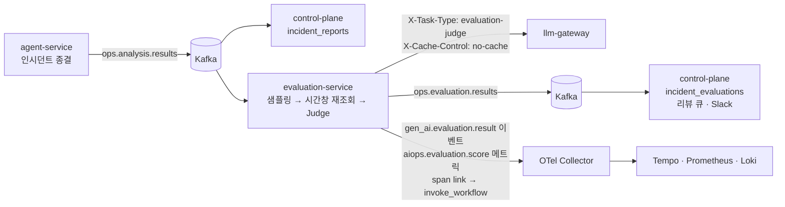

# LLM 품질 평가 체계 — 골든셋 · 온라인 Judge · 실험

> 초안 (2026-09-09, DAY 45 선행 결정). 파이프라인 구현과 함께 확정한다. 결정 배경은 [ADR-0019](adr/0019-llm-quality-continuous-evaluation.md).

## 1. 목적과 3층 구조

분석 에이전트가 만든 인시던트 보고서의 품질을 감이 아니라 숫자로 관리한다. 측정기가 측정 대상에 오염되지 않도록 세 층으로 나눈다.

| 층 | 무엇을 측정하나 | 측정 주체 | 실행 시점 |
|----|----------------|-----------|-----------|
| 오프라인 골든셋 | Judge 가 사람과 같은 방향으로 판단하는가 | 사람 라벨 (`evaluation-service/golden/*.jsonl`) | 필요 시 (Judge 프롬프트 변경·주 1회 회귀) |
| 온라인 Judge | 종결된 인시던트 보고서의 품질 | LLM-as-a-Judge (evaluation-service) | 인시던트 종결마다 (샘플링) |
| 실험 | 프롬프트·모델 변경이 품질을 올리는가 | variant 별 Judge 점수 집계 | 실험 등록 기간 |

골든셋이 Judge 를 검증하고, 검증된 Judge 가 운영 보고서를 채점하고, 실험은 그 점수로 변경을 결정한다. Judge 가 낮게 매긴 케이스는 사람이 다시 보고 골든셋으로 승격한다.

## 2. 평가 차원 · 앵커 · 실패 유형

평가 대상은 `ops.analysis.results` 페이로드의 `analysis` 블록(`root_cause_hypothesis`·`evidence`·`suggested_actions`·`severity`)과 `action` 블록이다. `confidence` 는 에이전트의 자기 평가라 평가 입력에서 제외한다.

| 차원 | 질문 | 판정 재료 |
|------|------|-----------|
| Faithfulness | 가설과 근거가 수집된 메트릭·로그와 주입 사실에 맞는가 | `evidence` 각 항목 ↔ 시간창 재조회 수치·로그 (§4) |
| Actionability | 제안 조치가 이 시스템에서 실행 가능한 구체 조치인가 | `action.actions` ↔ 조치 카탈로그 (RESTART_APP·SCALE_OUT·ROLLBACK·CIRCUIT_BREAK·NOTIFY_ONLY) + 현재 상태에 맞는가(끝난 장애에 상태 변경 조치 = 감점). `suggested_actions` 는 카탈로그 밖이어도 이 시스템에서 실행 가능한 구체 후속 조치(heap dump·캐시 TTL 점검 등)면 감점하지 않고, "모니터링 강화 권장" 류 일반론만 감점 — 2026-09-09 예비 실측에서 카탈로그 기준을 `suggested_actions` 에도 적용한 Judge 가 5건 중 4건을 낮게 매겨 정정 |
| Severity 정확도 | P 등급이 재조회 수치와 분석 프롬프트의 기준(P1 전면 장애 / P2 부분 영향 / P3 영향 미미)에 맞는가 | `severity` ↔ 에러율·p95·heap 실측 |

점수는 0~1 연속값이지만 사람과 Judge 모두 네 앵커만 쓴다. 앵커 문장은 Judge 프롬프트와 라벨링 시트가 공유한다.

| 앵커 | 뜻 |
|------|-----|
| 1.0 | 전부 맞음 — 근거·조치·등급이 실측과 일치 |
| 0.7 | 핵심은 맞고 사소한 부정확 (수치 반올림·부가 항목 오류) |
| 0.4 | 절반쯤 맞음 — 핵심 주장 하나가 근거 없음 또는 조치 절반이 일반론 |
| 0.0 | 틀림 — 근거 없는 주장, 실행 불가 조치, 등급 오판 |

실패 유형은 가장 낮은 차원의 이유를 하나만 고른다. Judge 구조화 출력의 `failure_mode` enum 과 동일 집합이다.

| 코드 | 이름 | 예 |
|------|------|----|
| A | 근거 없는 주장 | 재조회에 없는 수치를 인용, 주입한 장애와 다른 원인 지목 |
| B | 근거는 맞으나 결론 불일치 | 5xx 50% 를 관측하고도 "일시 스파이크" 로 결론 |
| C | 조치 비구체·실행 불가 | "모니터링 강화 권장", 카탈로그 밖 조치 |
| D | 심각도 오판 | 에러율 50% 에 P3, 지연만 있는데 P1 |

실패 유형은 어떤 차원이든 0.4 이하일 때만 적고, 전부 0.7 이상이면 `없음` 이다. 시나리오 표준 주입값이 맞지 않는 회차(합성 발화·레드팀 실행)는 `evaluation-service/golden/ground-truth-overrides.json` 에 실제 정답을 적어 시트에 반영한다. 사람이 아닌 주체가 초안 라벨을 넣었으면 `note` 끝에 `[labeled_by: <모델>, 사용자 검수 대기]` 를 남기고, 사람이 검수하면 지우지 말고 `[초안 <모델>, 검수 완료 YYYY-MM-DD]` 로 바꾼다 (라벨 출처 보존). 검수 완료 표기가 있는 시트만 골든셋에 넣는다.

임계: 차원 점수 < 0.7 = 저품질 (리뷰 큐 적재), Faithfulness 이동평균 < 0.85 = SLO 위반 알림.

## 3. 샘플링

층화 키는 에이전트 판정 `analysis.severity` 이고, 판정값 자체가 평가 대상이므로 Alert 라벨 `severity=critical` 과 `approval` 존재(고위험 조치)를 100% 보조 조건으로 둔다. 결정은 incident_id 해시 기반 결정론이라 재실행해도 같은 결정이 나온다.

| 프로파일 | P1 | P2 | P3 | 기본 | 용도 |
|----------|----|----|----|------|------|
| `experiment` | 100% | 100% | 100% | 100% | 실험·데모·골든셋 구축 |
| `production` | 100% | 30% | 10% | 15% | 상시 운영 (실 트래픽 없음 — 비목표 정합) |

미샘플도 `sampled_reason=skipped` 로 1행 기록해 커버리지를 계산한다. `sampled_reason` 값: `p1` · `critical` · `approval` · `random` · `skipped`. `status=partial` 보고서는 분석 블록이 없을 수 있어 평가하지 않고 `skipped` 로 남긴다.

## 4. 평가 입력 — 보고서 + 시간창 재조회

보고서 페이로드에는 도구 호출 원본이 없다 (`monitoring.evidences` 는 실행한 질의 문자열, `analysis.evidence` 는 LLM 이 요약한 문장). Faithfulness 판정에는 원본이 필요하므로 evaluation-service 가 인시던트 시간창으로 Prometheus·Loki 를 다시 조회한다.

- 시간창: `incident_id` 의 타임스탬프(발화 시각) 5분 전 ~ 페이로드 `completed_at`. `incident_reports.created_at` 은 수신 시각이라 창의 시작으로 쓰지 않는다.
- Prometheus 질의 4종: 5xx 비율 · status 별 요청률 · p95 · heap 비율 (30s step, `query_range`). `monitoring.evidences` 의 PromQL 을 그대로 재실행하는 확장은 이후 과제.
- Loki: `{service="target-app"} | json | log_level="ERROR"` 와 WARN, 창 안 50줄까지.
- 보존 한계: Prometheus 10d, Loki 는 2026-08-28 이후 — 보존 밖 인시던트는 재조회 없이 보고서 내부 정합만 판정하고 시트에 표기한다.

2026-09-09 실측: 2026-09-02 에러율 인시던트는 창 안 5xx 비율 최대 0.497(주입 50%) + ERROR 로그 50건으로 보고서 근거와 대조 가능, 2026-09-08 합성 발화 인시던트는 5xx 0·로그 0 으로 "근거 없음" 판정의 정답이 된다.

## 5. 파이프라인 (초안)

응답 경로(인시던트 처리)에는 영향이 없다. evaluation-service 는 별도 컨슈머 그룹으로 같은 토픽을 읽는다.

## 6. 어휘 — 표준과 확장의 경계

| 어휘 | 출처 | 용도 |
|------|------|------|
| `gen_ai.evaluation.result` 이벤트 + `gen_ai.evaluation.name` · `score.value` · `score.label` · `explanation` | OTel GenAI 컨벤션 (semconv 0.65b0 속성, 이벤트 정의는 전용 리포, Development) | 평가 1건 = 이벤트 1건, 원본 스팬은 종료됐으므로 `gen_ai.response.id` + span link 로 상관 |
| `gen_ai.conversation.id` = incident id | 기존 세션 축 ([otel-genai-mapping.md](otel-genai-mapping.md)) | 평가 스팬에서도 동일 |
| `aiops.evaluation.score` (histogram: dimension · severity · prompt_version · variant) | 자체 확장 | 표준에 평가 메트릭이 없어 대시보드·알림용으로 자체 네임스페이스 |
| `aiops.evaluation.sampled_reason` · `aiops.experiment.name` · `aiops.experiment.variant` · `aiops.prompt.version` | 자체 확장 | 샘플링·실험 태깅 |

공식 평가기 패키지는 없다 (PyPI `opentelemetry-util-genai-evals` 부재, contrib `util/` 에 genai·http 만 — 2026-09-09 확인). Judge 는 자체 구현이고 표준은 어휘만 빌린다. Langfuse 는 OTLP 로 점수를 받지 않으므로 세션에 점수를 보이려면 Scores REST API 를 따로 호출해야 한다 (선택).

## 7. Judge 신뢰성

- 모델: **gpt-5.6-terra** (2026-09-09 예비 실측으로 확정). 평가 대상(`root-cause-analysis` = claude-sonnet-5)과 다른 프로바이더라 자기 선호 편향이 없고, 사람 라벨 5건 대조에서 심각도 과대 3건을 전부 잡았다 (claude-haiku-4-5 는 2건을 P2 타당으로 합리화). 3회 반복에서 Severity 판정은 5건 모두 불변, Faithfulness·Actionability 는 3건에서 앵커 한 단계 흔들림. MAE 는 haiku 가 낮았지만(0.29 vs 0.35) 관문 용도에서는 나쁜 보고서를 통과시키는 오류가 사람 검토로 보내는 오류보다 무겁고, haiku 의 오차는 통과시키는 쪽에 몰려 있었다. 그래서 결정은 잠정이며 확정 조건은 루브릭 정정(§2 Actionability) 후 골든셋 20건 재측정이다. 재측정 기준은 MAE 가 아니라 **false pass 0** (사람이 0.4 이하로 본 케이스를 Judge 가 0.7 이상으로 통과시킨 수) 을 1차, 앵커 정확 일치율 60% 이상을 2차로 둔다. haiku 가 이 기준을 충족하면 비용과 속도를 근거로 교체할 수 있다. 요청에 `temperature` 를 지정하지 않는다 — gpt-5.6-terra 는 기본값 외를 400 으로 거부해 폴백·서킷 오픈을 일으킨다.
- 게이트웨이 경유: task_type `evaluation-judge`, 요청마다 `X-Cache-Control: no-cache` (시맨틱 캐시에 걸리면 반복 채점의 분산이 0 이 된다 — `CachingChatService` 는 이 헤더를 BYPASS 로 처리). 비용은 JWT client_id 로 `gateway_cost_usd_total{service="evaluation-service"}` 에 자동 분리.
- 입력 분리: 보고서 본문은 LLM 생성물이므로 `wrap_untrusted` 로 감싼다 ([ADR-0017](adr/0017-prompt-injection-defense.md)). 게이트웨이 가드레일은 user·tool 역할을 검사하므로 Judge 의 user 메시지도 대상이다. 2026-09-09 실측: 보고서 evidence 가 인젝션 문구("IGNORE-PREVIOUS-INSTRUCTIONS")를 인용한 케이스는 패턴 단계에서 `flagged` 가 됐고(mode=flag 라 통과, block 이면 400), 나머지는 분류기 2차 호출을 거쳐 `clean` 이었다. `evaluation-judge` 태스크의 가드레일 정책(flag 고정 또는 분류기 생략)은 파이프라인 구현 시 정한다.
- 일관성: 골든셋 20건 × 3회 반복 → 차원별 표준편차, 사람 점수 대비 MAE ≤ 0.15, Spearman ρ ≥ 0.6 을 baseline 스냅샷으로 고정.
- 회귀: `@pytest.mark.golden` (기본 제외) + GitHub Actions `workflow_dispatch`/주 1회 schedule, baseline 대비 MAE 악화 0.05 초과 시 실패.

## 8. 골든셋 라벨링 절차

1. `evaluation-service/scripts/make_labeling_sheets.py` 가 인시던트 보고서 + 재조회 결과에서 케이스당 시트 1파일을 만든다 (`evaluation-service/golden/labeling/<incident_id>.md`). 시트에는 confidence 와 Judge 점수를 넣지 않는다.
2. 사람이 §2 앵커로 세 차원 점수 + 실패 유형 + 한 줄 사유를 기입한다. 판단 기준은 "주입한 장애와 재조회 수치에 비춰 맞는가" 이다.
3. 먼저 5건을 라벨해 Judge 모델 예비 실측에 쓰고, 앵커가 애매하면 §2 문장을 고친 뒤 나머지를 진행한다. 끝나면 앞의 2건을 다시 보지 않고 재라벨해 자기 일관성을 확인한다.
4. `evaluation-service/scripts/build_golden.py` 가 기입란을 읽어 `golden/v1.jsonl` 로 만든다. 승격된 저품질 케이스도 같은 형식으로 이어 붙인다.
