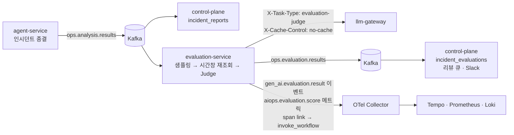

# LLM 품질 평가 체계 — 골든셋 · 온라인 Judge · 실험

> 확정 (2026-09-16, DAY 50 — 3층 구현·골든셋 baseline·실험 리포트 1건 뒤. 초안 2026-09-09 DAY 45, 구현 반영 2026-09-10~16). 이후 변경은 §5 구현 상태 문단에 날짜와 함께 덧붙인다. 결정 배경은 [ADR-0019](adr/0019-llm-quality-continuous-evaluation.md), 코드는 [`evaluation-service/`](../evaluation-service/README.md).

## 1. 목적과 3층 구조

분석 에이전트가 만든 인시던트 보고서의 품질을 감이 아니라 숫자로 관리한다. 측정기가 측정 대상에 오염되지 않도록 세 층으로 나눈다.

| 층 | 무엇을 측정하나 | 측정 주체 | 실행 시점 |
|----|----------------|-----------|-----------|
| 오프라인 골든셋 | Judge 가 사람과 같은 방향으로 판단하는가 | 사람 라벨 (`evaluation-service/golden/*.jsonl`) | 필요 시 (Judge 프롬프트 변경·주 1회 회귀) |
| 온라인 Judge | 종결된 인시던트 보고서의 품질 | LLM-as-a-Judge (evaluation-service) | 인시던트 종결마다 (샘플링) |
| 실험 | 프롬프트·모델 변경이 품질을 올리는가 | variant 별 Judge 점수 집계 | 실험 등록 기간 |

골든셋이 Judge 를 검증하고, 검증된 Judge 가 운영 보고서를 채점하고, 실험은 그 점수로 변경을 결정한다. Judge 가 낮게 매긴 케이스는 사람이 다시 보고 골든셋으로 승격한다.

## 2. 평가 차원 · 앵커 · 실패 유형

평가 대상은 `ops.analysis.results` 페이로드의 `analysis` 블록(`root_cause_hypothesis`·`evidence`·`suggested_actions`·`severity`)과 `action` 블록이다. `confidence` 는 에이전트의 자기 평가라 평가 입력에서 제외한다.

| 차원 | 질문 | 판정 재료 |
|------|------|-----------|
| Faithfulness | 가설과 근거가 수집된 메트릭·로그와 주입 사실에 맞는가 | `evidence` 각 항목 ↔ 시간창 재조회 수치·로그 (§4) |
| Actionability | 제안 조치가 이 시스템에서 실행 가능한 구체 조치인가 | `action.actions` ↔ 조치 카탈로그 (RESTART_APP·SCALE_OUT·ROLLBACK·CIRCUIT_BREAK·NOTIFY_ONLY) + 현재 상태에 맞는가(끝난 장애에 상태 변경 조치 = 감점). `suggested_actions` 는 카탈로그 밖이어도 이 시스템에서 실행 가능한 구체 후속 조치(heap dump·캐시 TTL 점검 등)면 감점하지 않고, "모니터링 강화 권장" 류 일반론만 감점 — 2026-09-09 예비 실측에서 카탈로그 기준을 `suggested_actions` 에도 적용한 Judge 가 5건 중 4건을 낮게 매겨 정정 |
| Severity 정확도 | P 등급이 재조회 수치와 분석 프롬프트의 기준(P1 전면 장애 / P2 부분 영향 / P3 영향 미미)에 맞는가 | `severity` ↔ 에러율·p95·heap 실측 |

점수는 0~1 연속값이지만 사람과 Judge 모두 네 앵커만 쓴다. 앵커 문장은 Judge 프롬프트와 라벨링 시트가 공유한다.

Judge 프롬프트 v2 (2026-09-11, `evaluation-service/evaluation/prompts/judge/v2.md`) 가 v1 대비 보정한 읽기 규칙 — 골든셋 20건 재측정에서 드러난 Judge 의 과잉 감점을 사람 라벨 기준으로 맞춘 것이다:
- **요약에 없는 관측 ≠ 거짓**: 재조회 근거는 4개 지표 + 로그 몇 줄의 증상 요약이고 에이전트는 더 많은 도구(배포 이력·설정·GC·기준선·전체 로그)를 썼다. 감점은 요약과 모순·창 밖 흔적을 현재 원인으로·핵심 신호 누락·요약이 부정하는 관측일 때만 (v1 은 검증 불가를 근거 없음(A)으로 매겨 Faithfulness MAE 0.58)
- **창 끝의 회복은 보고서 뒤의 일**: 보고서는 작성 시점 기준 — 창 안에서 증상이 진행 중이면 상태 변경 조치를 "끝난 장애" 로 감점하지 않는다 (v1 은 RESTART 를 창 끝 정상 복귀 근거로 감점)
- **Actionability 서열**: 앱 내부 상태(주입·누수) 증상에 RESTART 를 배제하고 차단만 두면 0.4(C), 과잉 조치 하나(부분 지연에 CIRCUIT_BREAK 1순위·단일 인스턴스에 SCALE_OUT)는 0.7
- **Severity 임계 명시**: 5xx 10%·p95 3s·heap 85% — 임계 미만의 국지적 버스트에 P2 는 과대(0.4, D)

| 앵커 | 뜻 |
|------|-----|
| 1.0 | 전부 맞음 — 근거·조치·등급이 실측과 일치 |
| 0.7 | 핵심은 맞고 사소한 부정확 (수치 반올림·부가 항목 오류) |
| 0.4 | 절반쯤 맞음 — 핵심 주장 하나가 근거 없음 또는 조치 절반이 일반론 |
| 0.0 | 틀림 — 근거 없는 주장, 실행 불가 조치, 등급 오판 |

실패 유형은 가장 낮은 차원의 이유를 하나만 고른다. Judge 구조화 출력의 `failure_mode` enum 과 동일 집합이다.

| 코드 | 이름 | 예 |
|------|------|----|
| A | 근거 없는 주장 | 재조회에 없는 수치를 인용, 주입한 장애와 다른 원인 지목 |
| B | 근거는 맞으나 결론 불일치 | 5xx 50% 를 관측하고도 "일시 스파이크" 로 결론 |
| C | 조치 비구체·실행 불가 | "모니터링 강화 권장", 카탈로그 밖 조치 |
| D | 심각도 오판 | 에러율 50% 에 P3, 지연만 있는데 P1 |

실패 유형은 어떤 차원이든 0.4 이하일 때만 적고, 전부 0.7 이상이면 `없음` 이다. 시나리오 표준 주입값이 맞지 않는 회차(합성 발화·레드팀 실행)는 `evaluation-service/golden/ground-truth-overrides.json` 에 실제 정답을 적어 시트에 반영한다. 사람이 아닌 주체가 초안 라벨을 넣었으면 `note` 끝에 `[labeled_by: <모델>, 사용자 검수 대기]` 를 남기고, 사람이 검수하면 지우지 말고 `[초안 <모델>, 검수 완료 YYYY-MM-DD]` 로 바꾼다 (라벨 출처 보존). 검수 완료 표기가 있는 시트만 골든셋에 넣는다.

임계: 차원 점수 < 0.7 = 저품질 (리뷰 큐 적재), Faithfulness 이동평균 < 0.85 = SLO 위반 알림.

## 3. 샘플링

층화 키는 에이전트 판정 `analysis.severity` 이고, 판정값 자체가 평가 대상이므로 Alert 라벨 `severity=critical` 과 `approval` 존재(고위험 조치)를 100% 보조 조건으로 둔다. 결정은 incident_id 해시 기반 결정론이라 재실행해도 같은 결정이 나온다.

| 프로파일 | P1 | P2 | P3 | 기본 | 용도 |
|----------|----|----|----|------|------|
| `experiment` | 100% | 100% | 100% | 100% | 실험·데모·골든셋 구축 |
| `production` | 100% | 30% | 10% | 15% | 상시 운영 (실 트래픽 없음 — 비목표 정합) |

미샘플도 `sampled_reason=skipped` 로 1행 기록해 커버리지를 계산한다. `sampled_reason` 값: `p1` · `critical` · `approval` · `random` · `skipped`. `status=partial` 보고서는 분석 블록이 없을 수 있어 평가하지 않고 `skipped` 로 남긴다.

구현 (`evaluation-service/evaluation/sampling.py`, 2026-09-10):

- 판정 순서 = partial 제외 → P1 → critical → approval → 프로파일 비율. 보조 조건은 판정보다 먼저 보므로 프로파일 비율은 warning 규칙(latency)·승인 없음 케이스에만 실제로 적용된다.
- 결과 페이로드에 Alert 라벨이 없다 (`IncidentInfo` 가 severity 를 싣지 않음). critical 판정은 `alert_name` 으로 하며, 집합은 `infra/prometheus/rules/target-app-alerts.yml` 의 `labels.severity: critical` 규칙(에러율·heap)과 같게 유지한다. 페이로드에 Alert severity 를 싣는 agent-service 변경은 후보로만 둔다 (평가 때문에 응답 경로를 바꾸지 않는다).
- "approval 존재" = `approval.status` 가 approved·rejected·expired (사람 결정을 요청한 경우). `skipped` 는 NOTIFY_ONLY 뿐이라 요청이 없었다.
- 해시는 `sha256(incident_id)` 앞 8바이트 → [0, 1). 10k 표본에서 비율 오차 ±2% 이내를 테스트로 고정.
- 결정은 소비 스팬(`ops.analysis.results process`) 속성 `aiops.evaluation.sampled` · `sampled_reason` · `sample_rate` · `sample_profile` 과 INFO 로그 한 줄로 남는다. 저장(DB 1행)은 control-plane 연동 시.

## 4. 평가 입력 — 보고서 + 시간창 재조회

보고서 페이로드에는 도구 호출 원본이 없다 (`monitoring.evidences` 는 실행한 질의 문자열, `analysis.evidence` 는 LLM 이 요약한 문장). Faithfulness 판정에는 원본이 필요하므로 evaluation-service 가 인시던트 시간창으로 Prometheus·Loki 를 다시 조회한다.

- 시간창: `incident_id` 의 타임스탬프(발화 시각) 5분 전 ~ min(페이로드 `completed_at`, 발화 + 5분). `incident_reports.created_at` 은 수신 시각이라 창의 시작으로 쓰지 않는다. 끝에 상한을 두는 이유: 에이전트의 관측(monitor 60s + analysis 180s 상한)은 발화 후 5분 안에 끝나지만 `completed_at` 은 승인 대기·만료(최장 60분)까지 밀리고, 그대로 쓰면 뒤이은 다른 인시던트의 chaos 가 근거에 섞인다 (2026-09-10 실측 — memory 케이스 창에 7분 뒤 회차 error-rate 의 5xx 가 들어옴).
- Prometheus 질의 4종: 5xx 비율 · status 별 요청률 · p95 · heap 비율 (30s step, `query_range`). 전부 `job="target-app"` 으로 한정한다 — Alert 규칙과 같은 조건이고, 다른 JVM 앱(control-plane·llm-gateway)의 요청이 비율을 희석하지 않게 하기 위해서다 (2026-09-09 실측 스크립트는 무필터였다). `monitoring.evidences` 의 PromQL 을 그대로 재실행하는 확장은 이후 과제.
- Loki: `{service="target-app"} | json | log_level="ERROR"` 와 WARN, 창 안 50줄까지 (`direction=forward` — 상한에 걸려도 발화 직후 구간이 남는다).
- 보존 한계: Prometheus 10d, Loki 는 2026-08-28 이후 — 보존 밖 인시던트는 재조회 없이 보고서 내부 정합만 판정하고 시트에 표기한다. 재조회 결과가 전부 비면(시리즈 0·로그 0) 같은 취급이다.
- 재조회 실패(Prometheus·Loki 접속 불가)는 커밋 보류 사유가 아니다 — 근거 없음(`aiops.evaluation.evidence=unavailable`)으로 Judge 에 넘긴다. 근거 없이도 내부 정합 판정은 가능하고, 관측 스택 장애가 평가 토픽 소비를 멈추면 안 된다.
- 구현: `evaluation-service/evaluation/evidence.py` — 온라인 경로와 라벨링 시트 생성기가 같은 질의·창·요약 문장을 쓴다 (사람과 Judge 가 같은 근거를 읽는다).

2026-09-09 실측: 2026-09-02 에러율 인시던트는 창 안 5xx 비율 최대 0.497(주입 50%) + ERROR 로그 50건으로 보고서 근거와 대조 가능, 2026-09-08 합성 발화 인시던트는 5xx 0·로그 0 으로 "근거 없음" 판정의 정답이 된다.

## 5. 파이프라인

응답 경로(인시던트 처리)에는 영향이 없다. evaluation-service 는 별도 컨슈머 그룹(`evaluation-service`)으로 같은 토픽을 읽는다.

구현 상태 (2026-09-11): 소비 → 샘플링 → 시간창 재조회 → **Judge → 발행 → 저장**까지 동작한다. 소비 스팬 `ops.analysis.results process` 는 agent-service 발행 헤더를 부모로 삼아 인시던트 trace 에 붙고 `incident.id`·`gen_ai.conversation.id` 를 세운다 — Judge 스팬(`evaluate incident-report`, 보고서 `trace_ref` 로 원 실행 `invoke_workflow` 에 link)·게이트웨이 호출(`chat default`)이 이 축을 상속한다. 커밋 규약은 agent-service 컨슈머와 같다 (배치 수동 커밋, 평가 발행 실패만 커밋 보류, 건너뜀·Judge 판정 실패(`error.type`)는 정상 종료). `ops.evaluation.results` 페이로드 계약은 `evaluation/judge.py` 의 `Evaluation.to_payload()` — `incident_id` · `scores{차원: {score, reason}}` · `failure_mode` · `low_quality` · `judge_model`(게이트웨이 응답 실모델) · `prompt_version`(Judge 프롬프트) · `analysis_prompt_version`(보고서 `analysis.prompt_version`, 실험 축) · `evidence_available` · `evaluated_at`. control-plane 은 `EvaluationResultConsumer` → `IncidentEvaluationService` → Flyway V5 `incident_evaluations` 에 저장한다 — 자연 키 `(incident_id, prompt_version, judge_model)` upsert 멱등, `low_quality` 면 `review_status=pending_review` 로 시작(아니면 `not_required`), 조회는 `GET /api/incidents/{id}/evaluations`.

구현 상태 (2026-09-13, 저품질 루프·SLO): 저품질 신규 저장은 `LowQualityEvaluationStored` 이벤트(AFTER_COMMIT·@Async) → `SlackReviewRequestNotifier` 가 검토 요청을 보낸다 (인시던트·F/A/S·실패 유형·0.7 미만 차원의 Judge 사유·보고서 링크·검토 API 경로 — 재수신 갱신은 이벤트 없음). 리뷰 큐는 `GET /api/evaluations/review-queue?status=pending_review|reviewed|promoted|dismissed&limit=`(`ops:read`), 사람 검토는 `POST /api/evaluations/{id}/review`(`ops:approve` — 사람의 라벨 결정이라 승인과 같은 등급) 본문 `status` · `human_scores{faithfulness, actionability, severity_accuracy}` · `failure_mode` · `note` · `reviewed_by` — 라벨 규약(앵커 4단계·유형 규칙, `promoted` 는 점수+유형 필수)은 `EvaluationReview` 가 `build_golden.py` 와 같은 규칙으로 검증하고(400), `promoted` 는 종결이라 재검토는 409 다 (골든셋 파일과 DB 가 어긋나지 않게). Flyway V6 가 사람 검토 컬럼(`human_scores` jsonb·`human_failure_mode`·`review_note`·`reviewed_by`·`reviewed_at`)을 더한다. 승격은 `evaluation-service/scripts/promote_golden.py` — `status=promoted` 행을 라벨링 시트로 만들고 `build_golden.py` 재생성이 jsonl 에 넣는다 (§8-6). 품질 SLO 는 Prometheus Alert Rule(`infra/prometheus/rules/quality-alerts.yml`, 차트 `prometheusrule-quality.yaml`) `AiopsFaithfulnessLow`(1h 평균 < 0.85, 5m) · `AiopsFaithfulnessLow7d`(7d 평균 < 0.85, **표본 10건 이상일 때만** — 평가 2~3건이 7일 내내 발화한 2026-09-14 실측) · `AiopsJudgeErrorRate`(Judge 실패율 > 20%, 호출 3회 이상) — 라벨 `kind=quality` 를 control-plane 웹훅(`AlertIngestService`)이 보고 인시던트를 만들지 않고 `SlackQualitySloNotifier` 로 발화·해소를 보낸다 (Alertmanager 는 `kind=quality` 라우트만 추가 — 재통지 `repeat_interval` 24h, 기본 30m 은 추세 알림에 과하다; Prometheus `external_labels.cluster`(compose/kind)가 메시지 머리에 실려 두 환경이 한 채널을 써도 출처가 보인다). 룰의 창 증가분은 `increase()` 하나가 아니라 "창 시작에 있던 시리즈는 `increase()`(리셋 처리) + 창 안에서 생긴 시리즈(`x unless x offset W`)는 현재값" 의 합 — `increase()` 만 쓰면 창 안에서 처음 생긴 시리즈의 초기값을 세지 않아 평가가 드문 창에서 분모가 0 이 되고, "현재 합 − 창 시작 합" 만 쓰면 재기동으로 인스턴스 라벨이 바뀐 옛 시리즈가 음수를 만든다 (2026-09-13 둘 다 실측). 대시보드는 `quality-evaluation`(사본 2벌).

구현 상태 (2026-09-15, 실험 층 — ADR-0019 결정 ③ 2단 배정): **배정은 agent-service**. `app/experiments/experiments.yml` 에 실험을 정의하고(`name`·`target: analysis`·`status active|concluded`·`sample`·`variants{A: {prompt}, B: {prompt | model_override}}`, 첫 variant = control) 워크플로 시작 시 `ExperimentAssigner` 가 `sha256(name:incident_id)` 로 편입(`< sample`)과 variant 를 정한다 — 해시 결정론이라 재개·재생에서도 같은 variant, 실험 이름이 salt 라 실험끼리 얽히지 않는다. 활성 실험 중 첫 하나만 배정한다 (데모 표본 한계). 배정은 상태 `experiment`(체크포인트) → 스팬 `aiops.experiment.name`·`aiops.experiment.variant`(`invoke_workflow`·`invoke_agent analysis`) → 보고서 최상위 `experiment{name, variant}` → evaluation-service `Evaluation.experiment_name/variant`(페이로드 `experiment_name`·`experiment_variant`, 메트릭 속성 `aiops.experiment.*` — 실험 밖은 `none`) → control-plane Flyway V7 `incident_evaluations.experiment_name/experiment_variant` 로 흐른다. 프롬프트 variant 는 분석 노드가 레지스트리에서 그 버전을 읽어 `analysis.prompt_version` 에 남기고, **모델 variant 만 게이트웨이**: 분석 노드가 LLM 요청 헤더 `X-Experiment-Variant: <name>:<variant>` 를 보내면 `ModelRouter` 가 `gateway.yml` `gateway.routing.experiments` 에 정의된 (실험명·태스크 일치·variant) 일 때만 모델을 바꾸고 응답 `X-Gateway-Variant` 로 알린다 — 미정의는 무시 + WARN (헤더로 임의 모델 지정은 예산·정책 우회). 적용된 variant 는 `Route.variant` → `gateway_requests_total`·`gateway_cost_usd_total`(라벨 `variant`, 없으면 `none`) → 비용 원장 `variant` 컬럼 → 스팬 `gateway.variant`(서버·클라이언트 양쪽) 로 비용 축에 붙는다. 집계는 `GET /api/experiments/{name}/summary`(`ops:read`) — variant 별 n·차원 평균·저품질률 (비용·처리 시간은 게이트웨이 메트릭·Tempo 에서 — 리포트 스크립트 몫). 표본 확보는 `infra/scripts/experiment-run.sh <experiment> <rounds>`(e2e 3종 순환·jsonl·재시도 1·진행 파일 재개·승인 대기는 `AUTO_DECIDE` 로 자동 결정 — 결정이 없으면 보고서 발행이 만료까지 미뤄져 회차가 시간 초과된다) 와 `agent-service/scripts/replay_analysis.py`(저장 보고서로 분석 노드만 재실행 — `incident_id = <원본>-replay-<variant>`, `replay.of`, 도구 조회가 "지금" 기준이라 원본 시각으로 앵커되지 않는 한계는 리포트에 명시). 대시보드 패널 12 가 variant 별 Faithfulness 1h 평균. 실험 1 처리군 프롬프트 `analysis/v2.md` 는 추론 구조("근거 인용 → 가설 → 반증 확인 → 결론")만 바꾸고 severity 기준·환경 특성은 v1 과 같다 — 단일 변인(테스트가 절 동일성을 고정).

구현 상태 (2026-09-16, 실험 중 감지·리포트): "어느 쪽이 나은가"(승자)는 사람이 리포트로 판정하지만 "처리군이 조용히 나빠지는가"는 실험 중 자동 신호가 필요하다 — 실 인시던트가 처리군 보고서를 받는 동안 사람이 패널을 보고 있지 않기 때문. ① Slack 검토 요청(`SlackReviewRequestNotifier`)에 `실험 <name> · variant <v>` 한 줄 — 저품질 알림이 한 variant 에 몰리는 것이 채널만 봐도 보인다. ② 룰 `AiopsVariantFaithfulnessLow`(룰 파일 2벌): 처리군(`aiops_experiment_variant!="A"`) 24h 평균이 control(`A`) 보다 0.1 이상 낮고 **양쪽 표본 10건 이상**이면 `kind=quality` 로 발화 → 같은 웹훅 경로에서 `QualitySloAlert.experimentName/Variant`(알림 라벨 `aiops_experiment_name/variant` — `sum by` 라벨이 그대로 알림 라벨) 를 읽어 메시지 머리에 실험 좌표를 붙인다. 파생 벡터에는 라벨 매처를 쓸 수 없어 레코딩 룰 3종(`aiops:evaluation_faithfulness_sum|count:increase24h`·`aiops:evaluation_faithfulness_variant:avg24h`)으로 variant 별 시리즈를 먼저 만든다. control = `experiments.yml` 첫 variant 규약을 라벨값 `A` 로 고정. 룰 단위 테스트 `infra/prometheus/rules/tests/quality-alerts.test.yml`(`promtool test rules` — 창 안 신규 시리즈 경로·24h 뒤 `increase()` 경로·표본 10건 미만 비발화·실험 밖 시리즈 제외)이 조인·임계를 고정한다 — 실 데이터로는 양쪽 10건이 모여야 발화해 하루 안에 볼 수 없다. 룰 발화 뒤 중단은 사람이 `status: concluded` 로 바꿔 재기동 — 자동 중단·자동 승격은 넣지 않는다(표본 한계·Judge 지연·human-in-the-loop). 리포트는 `evaluation-service/scripts/experiment_report.py --experiment <name> --since <ISO>`: 원천 3 — `GET /api/experiments/{name}/evaluations`(인시던트당 최신 평가 1건, Judge 3차원·저품질), Tempo(`invoke_agent analysis` 스팬 지속 시간 + 직계 `chat` 스팬 `gen_ai.usage.*` — 분석 노드만 잰다, 승인 대기는 사람 몫), 비용 = 토큰 × 단가(gateway.yml `gateway.cost.prices` 와 같은 값 — 원장에는 incident 축이 없다) → variant 별 표·차이의 부트스트랩 95% CI(B=2000·seed 고정, 재현 가능)·사전 기준 판정(Faithfulness +0.05 이상 && 비용 +30% 이내, CI 가 0 포함 → 보류)·인시던트별 산점 표. `--since` 는 프롬프트 수정 전 표본을 섞지 않기 위한 창. 첫 시운전(5건)에서 Faithfulness 가 양쪽 모두 1.0 으로 포화해 CI 가 (0, 0) — Judge 가 상단에서 변별력을 잃으면 실험이 차이를 못 본다(§7 신뢰성 후속 후보: 앵커 세분화 또는 Actionability 병행 기준).

## 6. 어휘 — 표준과 확장의 경계

| 어휘 | 출처 | 용도 |
|------|------|------|
| `gen_ai.evaluation.result` 이벤트 + `gen_ai.evaluation.name` · `score.value` · `score.label`(pass/fail = 0.7) · `explanation` | OTel GenAI 컨벤션 (semconv 0.65b0 속성, 이벤트 정의는 전용 리포, Development) | 차원 1개 = 이벤트 1건 (평가 1건 = 3건). 두 시그널로 낸다 — 규격대로 **로그 레코드**(event_name, Collector logs 파이프라인 → Loki) + 같은 속성의 **스팬 이벤트**(Tempo trace 뷰용). `gen_ai.response.id` 는 Judge 응답 id, 원 실행은 평가 스팬의 span link |
| `gen_ai.conversation.id` = incident id | 기존 세션 축 ([otel-genai-mapping.md](otel-genai-mapping.md)) | 평가 스팬에서도 동일 |
| `aiops.evaluation.score` (histogram, 버킷 = 앵커 경계 0.0/0.4/0.7/1.0; 속성 `aiops.evaluation.dimension` · `aiops.evaluation.severity` · `aiops.prompt.version`(평가 대상 분석 프롬프트) · `aiops.evaluation.judge_prompt_version`) | 자체 확장 | 표준에 평가 메트릭이 없어 대시보드·알림용으로 자체 네임스페이스. Prometheus `aiops_evaluation_score_bucket` — `le="0.4"` 누적이 저품질 수. 실험 축 `aiops.experiment.name`·`aiops.experiment.variant` 는 히스토그램·verdicts 카운터에 함께 (실험 밖 `none` — 라벨 유무가 갈리면 `sum by` 가 두 갈래로 나뉜다) |
| `aiops.evaluation.verdicts` · `aiops.evaluation.judge.calls` · `aiops.evaluation.sampling` (counter; 속성 `aiops.evaluation.failure_mode`·`low_quality` / `aiops.evaluation.judge_outcome`(ok·error)·`error.type` / `aiops.evaluation.sampled`·`sampled_reason`·`sample_profile`) | 자체 확장 | 실패 유형 분포·Judge 실패율(`AiopsJudgeErrorRate`)·샘플링 커버리지 — 같은 사실이 스팬 속성에 있지만 알림 룰·대시보드 파이는 Prometheus 만 읽는다 (Postgres 데이터소스 없음) |
| `aiops.evaluation.sampled_reason` · `aiops.experiment.name` · `aiops.experiment.variant` · `aiops.prompt.version` | 자체 확장 | 샘플링·실험 태깅 — 실험 좌표는 agent-service 스팬(`invoke_workflow`·`invoke_agent analysis`)·평가 스팬(있을 때만)·평가 메트릭(항상, 없으면 `none`)에 같은 키. 게이트웨이 쪽 모델 variant 적용은 `gateway.variant` |

공식 평가기 패키지는 없다 (PyPI `opentelemetry-util-genai-evals` 부재, contrib `util/` 에 genai·http 만 — 2026-09-09 확인). Judge 는 자체 구현이고 표준은 어휘만 빌린다. Langfuse 는 OTLP 로 점수를 받지 않으므로 세션에 점수를 보이려면 Scores REST API 를 따로 호출해야 한다 (선택).

## 7. Judge 신뢰성

- 모델: **gpt-5.6-terra** (2026-09-09 예비 실측으로 확정). 평가 대상(`root-cause-analysis` = claude-sonnet-5)과 다른 프로바이더라 자기 선호 편향이 없고, 사람 라벨 5건 대조에서 심각도 과대 3건을 전부 잡았다 (claude-haiku-4-5 는 2건을 P2 타당으로 합리화). 3회 반복에서 Severity 판정은 5건 모두 불변, Faithfulness·Actionability 는 3건에서 앵커 한 단계 흔들림. MAE 는 haiku 가 낮았지만(0.29 vs 0.35) 관문 용도에서는 나쁜 보고서를 통과시키는 오류가 사람 검토로 보내는 오류보다 무겁고, haiku 의 오차는 통과시키는 쪽에 몰려 있었다. 그래서 결정은 잠정이며 확정 조건은 루브릭 정정(§2 Actionability) 후 골든셋 20건 재측정이다. 재측정 기준은 MAE 가 아니라 **false pass 0** (사람이 0.4 이하로 본 케이스를 Judge 가 0.7 이상으로 통과시킨 수) 을 1차, 앵커 정확 일치율 60% 이상을 2차로 둔다. haiku 가 이 기준을 충족하면 비용과 속도를 근거로 교체할 수 있다. 요청에 `temperature` 를 지정하지 않는다 — gpt-5.6-terra 는 기본값 외를 400 으로 거부해 폴백·서킷 오픈을 일으킨다.
- 게이트웨이 경유: task_type `evaluation-judge`, 요청마다 `X-Cache-Control: no-cache` (시맨틱 캐시에 걸리면 반복 채점의 분산이 0 이 된다 — `CachingChatService` 는 이 헤더를 BYPASS 로 처리). 비용은 JWT client_id 로 `gateway_cost_usd_total{service="evaluation-service"}` 에 자동 분리.
- 입력 분리: 보고서 본문은 LLM 생성물이므로 `wrap_untrusted` 로 감싼다 ([ADR-0017](adr/0017-prompt-injection-defense.md)). 게이트웨이 가드레일은 user·tool 역할을 검사하므로 Judge 의 user 메시지도 대상이다. 2026-09-09 실측: 보고서 evidence 가 인젝션 문구("IGNORE-PREVIOUS-INSTRUCTIONS")를 인용한 케이스는 패턴 단계에서 `flagged` 가 됐고(mode=flag 라 통과, block 이면 400), 나머지는 분류기 2차 호출을 거쳐 `clean` 이었다. `evaluation-judge` 태스크의 가드레일 정책(flag 고정 또는 분류기 생략)은 파이프라인 구현 시 정한다.
- 일관성 측정 (2026-09-11, `scripts/judge_baseline.py`, 골든셋 20건 × 3회, **온라인 형상 = 주입 사실 없이 재조회 근거만**): baseline 은 `evaluation-service/golden/judge-baseline.json` (프롬프트 v2). 결과 —

  | 프롬프트 | 전체 MAE | 앵커 정확 일치 | false pass | 관문 일치 | 유형 일치 | F MAE / ρ | A MAE / ρ | S MAE / ρ | 반복 표준편차 F/A/S |
  |---|---|---|---|---|---|---|---|---|---|
  | v1 | 0.343 | 31.7% | 2 | 35% | 25% | 0.58 / 0.23 | 0.30 / 0.30 | 0.15 / 0.66 | 0.049 / 0.075 / 0.054 |
  | **v2** | **0.122** | **68.3%** | **1** | 70% | 65% | 0.26 / 0.15 | 0.06 / 0.75 | 0.045 / 0.82 | 0.066 / 0.014 / 0.007 |

  기준 대조: MAE ≤ 0.15 충족, 앵커 일치 ≥ 60% 충족, ρ ≥ 0.6 은 Actionability·Severity 충족·Faithfulness 미달(사람 F 라벨이 1.0 에 몰려 순위 상관이 낮게 나온다 — 분산 부족), **false pass 1 미달** — 남은 1건은 2026-08-28 합성 발화(보존 밖이라 재조회 근거 없음·주입 사실도 없음)의 Severity 과대를 Judge 가 잡지 못한 것으로, 온라인에서는 재조회 근거가 항상 있어 같은 조건이 재현되지 않는다. v1 → v2 보정 내용은 §2. 측정 비용 60건 ≈ 0.7 USD(건당 0.012) — 게이트웨이 `evaluation-service` 일 한도를 1.0 → 3.0 으로 올렸다 (측정 1회로 소진되면 haiku 다운그레이드가 측정을 오염). v1 의 과잉 감점 진단: Judge 가 재조회 요약에 없는 도구 관측(MCP·GC·전체 로그)을 근거 없음(A)으로 매겼고, 창 끝의 정상 복귀를 "끝난 장애" 로 읽어 RESTART 를 감점했다.
- 회귀: `tests/test_golden_regression.py` `@pytest.mark.golden` (기본 제외, `pyproject.toml` addopts) — 실 Judge 20건 × 1회, baseline 대비 전체 MAE 악화 0.05 초과 또는 false pass 증가 시 실패. GitHub Actions `golden-regression.yml` (`workflow_dispatch` + 주 1회) 은 리포지토리 시크릿(게이트웨이·auth-server 주소·시크릿)이 있을 때만 실행되고 없으면 skip — 호스팅 러너에서 로컬 게이트웨이에 닿는 경로가 없어 실효는 로컬 실행(README) 이다.

## 8. 골든셋 라벨링 절차

1. `evaluation-service/scripts/make_labeling_sheets.py` 가 인시던트 보고서 + 재조회 결과에서 케이스당 시트 1파일을 만든다 (`evaluation-service/golden/labeling/<incident_id>.md`). 재조회 파일이 없으면 `--prometheus-url/--loki-url` 로 온라인 경로와 같은 `EvidenceCollector` 를 써서 직접 조회한다. 시트에는 confidence 와 Judge 점수를 넣지 않는다.
2. 사람이 §2 앵커로 세 차원 점수 + 실패 유형 + 한 줄 사유를 기입한다. 판단 기준은 "주입한 장애와 재조회 수치에 비춰 맞는가" 이다.
3. 먼저 5건을 라벨해 Judge 모델 예비 실측에 쓰고, 앵커가 애매하면 §2 문장을 고친 뒤 나머지를 진행한다. 끝나면 앞의 2건을 다시 보지 않고 재라벨해 자기 일관성을 확인한다.
4. `evaluation-service/scripts/build_golden.py` 가 기입란을 읽어 `golden/v1.jsonl` 로 만든다 — 한 행 = 케이스 1건 (`incident_id` · `scenario` · `alert_name` · `severity` · `ground_truth` · `report`(confidence 제외 평가 대상 블록) · `evidence`(재조회 원본, 보존 밖은 null) · `human_scores` · `failure_mode` · `note` · `labeled_at`). 앵커 밖 점수·실패 유형 규약 위반·`사용자 검수 대기` 시트는 제외하고 사유를 출력한다. **매번 시트 전체에서 재생성**한다 — 원본은 시트 하나고 jsonl 은 파생물이라, 부분 append 가 없어야 원본 시트 수정과 승격 행 보존이 함께 성립한다. `report`·`evidence` 는 `--reports-dir` 파일이 원천이고 파일이 없으면(보존 기간이 지난 옛 케이스) 기존 jsonl 의 같은 행에서 승계한다.
5. 원천 확보: 기존 보고서 중 재조회 가능한 것은 Prometheus 보존(10d) 안의 것뿐이라, 부족한 시나리오는 chaos 재주입으로 만든다. 승인이 필요한 조치(RESTART_APP 등)는 사람 결정 또는 만료(`ops.approval.expire-after`, 기본 60분) 뒤에야 보고서가 발행되므로 수집 루프는 분석 완료(`action_approvals` 행)까지만 기다리고 시트는 보고서 도착분부터 만든다.
6. 승격 (저품질 루프): Judge 가 `< 0.7` 로 매긴 케이스는 `review_status=pending_review` 로 저장되고 Slack 검토 요청이 온다. 사람은 **보고서를** §2 앵커로 다시 채점해(Judge 점수는 참고값) `POST /api/evaluations/{id}/review` 로 `promoted`(골든셋 편입 — Judge 가 맞았든 틀렸든 사람 라벨이 있으면 표본이 된다) / `reviewed`(라벨만 기록) / `dismissed`(배울 것 없음·중복) 중 하나를 적는다. `scripts/promote_golden.py` 가 `promoted` 행을 읽어 **라벨링 시트**(`golden/labeling/<incident_id>.md`, 1~4절은 보고서·재조회, 5절은 DB 의 사람 라벨 + 승격 꼬리표)와 보고서 원문·재조회 파일(`--reports-dir`)을 만든다 — jsonl 을 직접 쓰지 않는다. 시트 `note` 에 `사용자 검수 대기` 가 있으면(초안 라벨) 검수를 마친 사람이 표기를 `[초안 …, 검수 완료 YYYY-MM-DD]` 로 바꾸고, 그 뒤 §8-4 `build_golden.py` 재생성으로 jsonl 에 들어간다. 원본은 시트 하나(초기 20건과 승격 건이 같은 규칙), jsonl 은 파생물, DB 는 승격 이력(promoted 종결)이다. 골든셋은 다시 만들지 않는다 — 기존 라벨은 baseline 의 기준이고, 승격분이 쌓이면 v2 로 이름을 올리고 `judge_baseline.py` 로 baseline 을 재설정한다. 재조회는 Prometheus 보존(10d) 안이어야 근거가 채워지므로 승격은 주간 리뷰(§9) 안에서 마친다.

## 9. 주간 리뷰 프로세스

주 1회, 리뷰 큐와 SLO 알림을 한 번에 본다. 순서가 곧 판단 기준이다.

1. **측정기 먼저**: `AiopsJudgeErrorRate` 가 울렸거나 골든셋 회귀(`golden-regression.yml`)가 실패했으면 Judge 쪽을 먼저 고친다 — 점수가 비거나 어긋난 상태에서 보고서 품질을 논할 수 없다.
2. **리뷰 큐 소화**: `pending_review` 를 최신순으로 읽고 케이스마다 §8-6 대로 사람 점수·실패 유형을 적는다. Judge 와 사람이 갈린 케이스는 반드시 `promoted` — 다음 Judge 프롬프트의 회귀 케이스다.
3. **실패 유형 분류 → 개선 후보**: 승격·검토된 케이스의 사람 실패 유형(`human_failure_mode`)을 센다. A(근거 없는 주장)·B(결론 불일치)가 많으면 분석 프롬프트의 검증 절차, C(조치 비구체)면 조치 카탈로그·action 프롬프트, D(심각도 오판)면 severity 기준 문장이 후보다. Judge 판정 기준 분포는 대시보드 실패 유형 패널(`aiops_evaluation_verdicts_total`)로 본다.
4. **SLO 해석**: `AiopsFaithfulnessLow`(1h)는 데모 창이라 표본 몇 건에 흔들린다 — 발화 자체보다 `aiops_prompt_version` 별 패널에서 어느 프롬프트 버전이 끌어내렸는지 본다. `AiopsFaithfulnessLow7d` 가 울리면 계통 변화다: 최근 프롬프트·모델·도구 변경을 되짚고 필요하면 `PROMPT_VERSION_OVERRIDES` 로 되돌린다. `AiopsVariantFaithfulnessLow` 는 실험 중 처리군 문제 신호다: 메시지 머리의 실험 좌표로 어느 variant 인지 보고 `experiment_report.py` 를 돌려 표본·CI 를 확인한 뒤, 중단이면 `experiments.yml` 을 `status: concluded` 로 바꿔 재기동한다(자동 중단 없음).
5. **실험 등록**: 개선 후보는 감으로 적용하지 않는다 — 새 프롬프트 버전 파일을 만들고 실험(ADR-0019 실험 층)으로 등록해 variant 별 Judge 점수로 승자를 정한다. 승자 적용 뒤 골든셋 회귀를 다시 돌려 baseline 이 흔들리지 않았는지 확인한다.
6. **골든셋 편입**: `promote_golden.py` 로 승격 시트를 만들고, 초안 시트는 검수해 표기를 바꾼 뒤 `build_golden.py` 로 jsonl 을 재생성한다. 승격분이 10건을 넘으면 골든셋 v2·baseline 재설정을 검토한다.

